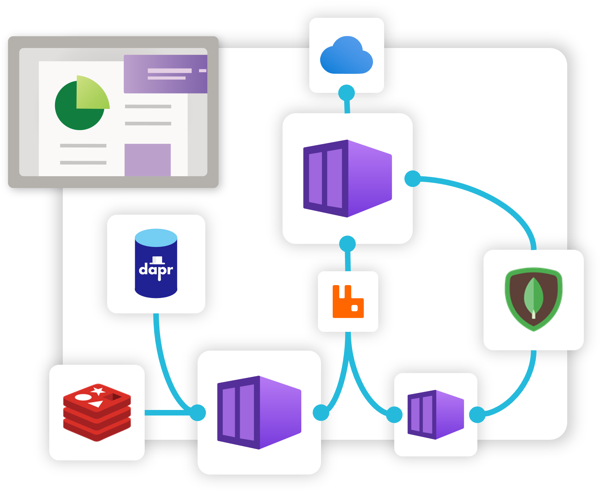
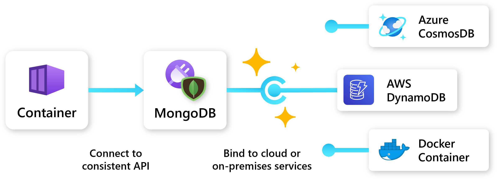
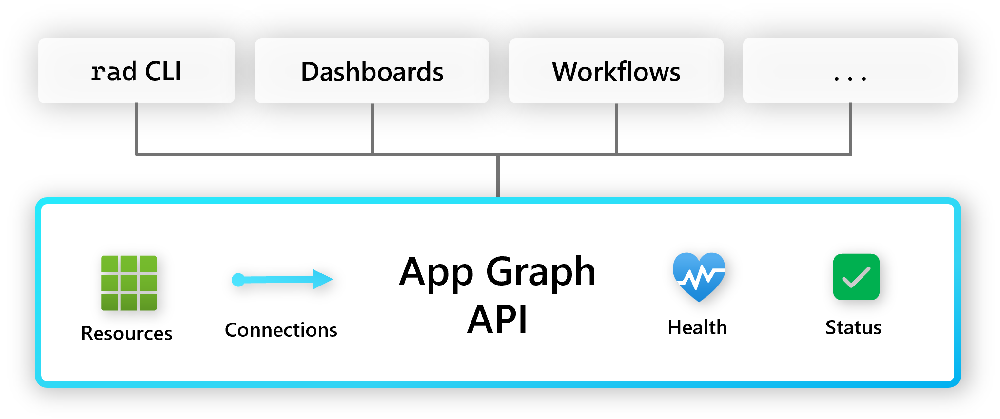

A Radius Application is the primary resource that brings all your "stuff" together. This can include services, dependencies, and relationships. Radius apps give you a single description and view into your entire application, and allow you to deploy and manage it easily.

## Add portability to your application

Radius Applications are designed to be cloud and platform agnostic. This means that you can define your application once, and deploy it to any cloud or platform that Radius supports. This allows you to easily move your application between clouds, or even between cloud and on-premises environments. Developers can define their requirements and dependencies (_Redis, SQL, Dapr, etc._) and operators can define the [environments]() and [Recipes]() that bind those requirements to the appropriate cloud resources.

Learn more about portable resources in the [portable resources docs]() and [Dapr docs]()

## Customize your application with extensions

Extensions allow you to customize how resources are generated or customized as part of deployment.

### Kubernetes Namespace extension

The Kubernetes namespace extension allows you to customize how all of the resources within your application generate Kubernetes resources. See the [Kubernetes mapping guide]() for more information on namespace mapping behavior

### Kubernetes Metadata extension

The [Kubernetes Metadata extension]() enables you set and cascade Kubernetes metadata such as labels and Annotations on all the Kubernetes resources defined with in your Radius Application.

## Query and understand your application with the Radius Application Graph

Radius Applications are more than just client-side configuration and automation, they also provide a server-side graph of your application. This graph can be queried and used to understand your application, and can be used to power other Radius features and custom tooling. Refer to the [API concept docs]() and [Postman How-To guide]() for more information on how to query the application graph.

## Resource schema 

Refer to the [application schema docs]() for more information on how to define an application.

