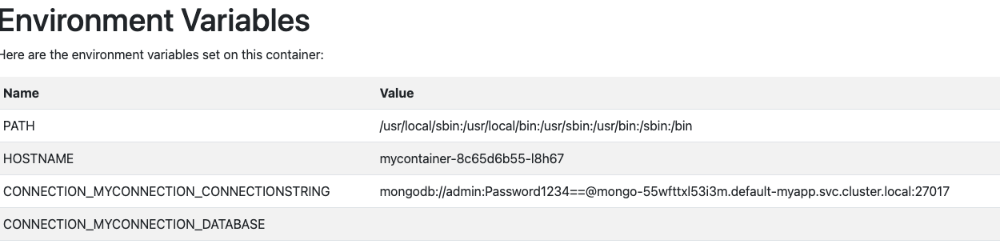

This how-to guide will teach how to connect to your dependencies via [connections]()

## Prerequisites

- [Radius CLI]()
- [Radius environment]()

## Step 1: Model an app and container

Create a new file named `app.bicep` and add an application and a [container]():



## Step 2: Add a Mongo database as a dependency

Next, add to `app.bicep` a [Mongo database](), leveraging the default "local-dev" Recipe:



## Step 3: Connect to the Mongo database

Connections from a container to a resource result in environment variables for connection information automatically being set on the container. Update your container definition to add a connection to the new Mongo database:



## Step 4: Deploy your app

1. Run your application in your environment:

   ```bash
   rad run ./app.bicep -a myapp
   ```
1. Visit [localhost:5000](http://localhost:5000) in your browser. You should see the following page, now showing injected environment variables:

   
   
## Step 5: View the application connections

Radius connections are more than just environment variables and configuration. You can also access the "application graph" and understand the connections within your application with the following command:

```bash
rad app connections
```

You should see the following output, detailing the connections between the `mycontainer` and the `db` Mongo database, along with information about the underlying Kubernetes resources running the app:

```
Displaying application: myapp

Name: mycontainer (Applications.Core/containers)
Connections:
  mycontainer -> mongo-db (Applications.Datastores/mongoDatabases)
Resources:
  mycontainer (kubernetes: apps/Deployment)
  mycontainer (kubernetes: core/Secret)
  mycontainer (kubernetes: core/ServiceAccount)
  mycontainer (kubernetes: rbac.authorization.k8s.io/Role)
  mycontainer (kubernetes: rbac.authorization.k8s.io/RoleBinding)

Name: mongo-db (Applications.Datastores/mongoDatabases)
Connections:
  mycontainer (Applications.Core/containers) -> mongo-db
Resources:
  mongo-xxx(kubernetes: apps/Deployment)
  mongo-xxx(kubernetes: core/Service)
```

## Cleanup

Run `rad app delete` to cleanup your Radius application, container, and mongo database:

```bash
rad app delete -a myapp
```

## Further reading

- [Connections]()
- [Container schema]()
