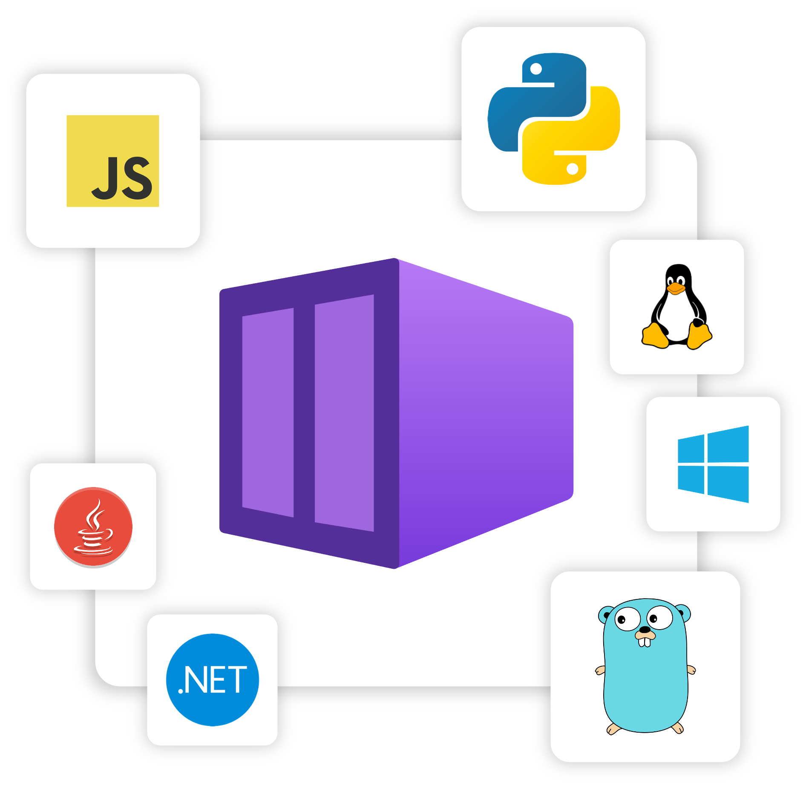

A Radius container enables you to run a container workload as part of your application across different platforms and runtimes. Your container can be a frontend UI, a backend API, a database, or any other container you need to run as part of your app. Plus, with Radius Connections, you can easily connect your container to other resources in your application, such as databases, message queues, and more and automatically configure your container with identity, secrets, and other configuration.

> Adding a container and want to jump to the reference docs? Check out the [container resource schema]().

## Supported runtimes

Radius containers are portable across container runtimes, allowing you to define your container workload once and run it on any of the supported runtimes.

### Kubernetes

Containers are deployed to the same Kubernetes cluster as your Radius installation, into the namespace that is defined in your application. For more information on how Radius resources map to Kubernetes objects, refer to the [Kubernetes mapping guide]().

#### Customize Kubernetes configurations

Radius provides a way to apply custom Kubernetes configurations to container resources that are created by Radius. This allows you to make use of Kubernetes configurations or features that are not supported by Radius, yet remain composable with other Radius features like [Connections](). Additionally, it provides a way to migrate your existing Kubernetes applications into Radius without having to rewrite your Kubernetes configurations, while giving you the option to incrementally adopt Radius features over time. The customizations are applied to the container resource via the [`runtimes`]() property within the container resource definition.

##### Base Kubernetes YAML

You can provide a Kubernetes YAML definition as a base or foundation upon which Radius will build your containers, enabling you to incrementally adopting Radius by starting with your existing YAML definition and use applying Radius customizations on top. The provided YAML is fully passed through to Kubernetes when Radius creates the container resource, which means that you may even provide a definition for a CRD that Radius has no visibility into. <!-- For more information on how to onboard existing Kubernetes resources into Radius, refer to the [base Kubernetes YAML guide]("guides/author-apps/kubernetes/how-to-yaml-base-support"). -->

Radius currently supports the following Kubernetes resource types for the `base` property: 

| Kubernetes Resource Types | Number of resources | Limitation |
|---------------------------|---------------------|------------|
| Deployment | 1 | Deployment name must match the name of the Radius container |
| ServiceAccount | 1 | ServiceAccount name must match the name of the Radius container using the correct namespace |
| Service | 1 | ServiceAccount name must match the name of the Radius container using the correct namespace |
| Secrets | Multiple | No limitation except within the respective namespace |
| ConfigMap | Multiple config maps | No limitation except within the respective namespace |

##### Pod patching

You can also "patch" the Kubernetes containers created and deployed by Radius using [PodSpec](https://kubernetes.io/docs/reference/kubernetes-api/workload-resources/pod-v1/#PodSpec) definitions. This allows for setting Kubernetes-specific configurations, as well as overriding Radius behaviors, which means that you may access all Kubernetes Pod features, even if they are not supported by Radius. <!-- For more information on how to patch Kubernetes pods, refer to the [Kubernetes pod patching guide]("guides/author-apps/kubernetes/how-to-patch-pod"). -->

## Container definition

Radius containers allow you to specify your image, ports, environment variables, volumes, and more. Refer to the [container resource schema]() for more information.

### Ports

Ports allow you to expose your container to incoming network traffic. Refer to the [networking guide]() for more information on container networking.

## Volumes

Volumes can be mounted to the container to provide access to data. There are two types of volumes, ephemeral and persistent.

Ephemeral volumes have the same lifecycle as the container, being deployed and deleted with the container. They create an empty directory on the host and mount it to the container.

Persistent volumes have life cycles that are separate from the container. Containers can mount these persistent volumes and restart without losing data. Persistent volumes can also be useful for storing data that needs to be accessed by multiple containers.

## Health Probes

Health probes are used to determine the health of a container. There are two types of probes, readiness and liveness. For more information on how to setup health probes, refer to the [container resource schema]().

### Readiness Probe

Readiness probes detect when a container begins reporting it is ready to receive traffic, such as after loading a large configuration file that may take a couple seconds to process. There are three types of probes available, httpGet, tcp and exec. 

For an **httpGet** probe, an HTTP GET request at the specified endpoint will be used to probe the application. If a success code is returned, the probe passes. If no code or an error code is returned, the probe fails, and the container won’t receive any requests after a specified number of failures. Any code greater than or equal to 200 and less than 400 indicates success. Any other code indicates failure.

For a **tcp** probe, the specified container port is probed to be listening. If not, the probe fails.

For an **exec probe**, a command is run within the container. A return code of 0 indicates a success and the probe succeeds. Any other return indicates a failure, and the container doesn’t receive any requests after a specified number of failures

Refer to the readiness probes section of the [container resource schema]() for more details.

### Liveness Probe

Liveness probes detect when a container is in a broken state, restarting the container to return it to a healthy state. There are three types of probes available, httpGet, tcp and exec.

For an **httpGet probe**, an HTTP GET request at the specified endpoint will be used to probe the application. If a success code is returned, the probe passes. If no code or an error code is returned, the probe fails, and the container won’t receive any requests after a specified number of failures. Any code greater than or equal to 200 and less than 400 indicates success. Any other code indicates failure.

For a **tcp probe**, the specified container port is probed to be listening. If not, the probe fails.

For an **exec probe**, a command is run within the container. A return code of 0 indicates a success and the probe succeeds. Any other return indicates a failure, and the container doesn’t receive any requests after a specified number of failures.

Refer to the probes section of the [container resource schema]() for more details.

## Connections

When a connection between two resources is declared, Radius injects resource related information into environment variables that are then used to access the respective resource without having to hard code URIs, connection strings, access keys, or anything that application code needs to successfully communicate.

These environment variables follow a naming convention that makes their use predictable. The naming pattern is derived from the connection name and resource type, which determines what values are required. This way the code that needs to read the values gets to define how they are named. Refer to the [reference documentation]() of each resource for more information. 

For example, adding a connection called `database` that connects to a MongoDB resource would result in the following environment variables being injected:

| Key | Value |
|-----|-------|
| `CONNECTION_DATABASE_CONNECTIONSTRING` | The connection string to the database |
| `CONNECTION_DATABASE_DATABASE` | Database name of the target database |
| `CONNECTION_DATABASE_USERNAME` | Username of the target database |
| `CONNECTION_DATABASE_PASSWORD` | Password of the target database |

Alternatively, if you already have another convention you would like to follow or if you just prefer to be explicit, you may ignore the values generated by a connection and instead override it by setting your own environment variable values. 

<!-- For more information on how to add connections, refer to the [connect to dependencies how-to guide]("guides/author-apps/containers/how-to-connect-dependencies"). -->

## Extensions

Extensions define additional capabilities and configuration for a container.

### Kubernetes metadata extension

The [Kubernetes metadata extension]() enables you to configure the Kubernetes metadata for the container. This includes the labels and annotations for the container. Refer to to the extension overview page to get more details about the extension and how it works with other Radius resources.

### Manual scaling extension

The manualScaling extension configures the number of replicas of a compute instance (such as a container) to run. Refer to the [container resource schema]() for more details.

### Dapr sidecar extension

The `daprSidecar` extensions adds and configures a [Dapr](https://dapr.io) sidecar to your application. Refer to the [container resource schema]() for more details

## Further reading

- [Container schema]()
