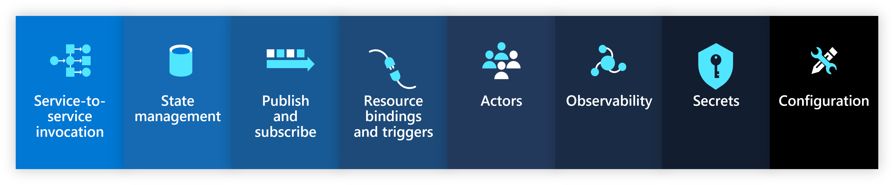

Radius offers first-class support for the [Dapr](https://dapr.io) runtime and building blocks to make it easy to make your code fully portable across code and infrastructure. Simply drop in your Dapr building blocks as resources and Radius will automatically configure and apply the accompanying Dapr configuration.

## Installation 

Follow the [Dapr installation instructions](https://docs.dapr.io/operations/hosting/kubernetes/kubernetes-deploy/) to install Dapr in your Kubernetes cluster. Once installed, you can begin adding Dapr sidecars and building blocks.



## Sidecar

A [Dapr sidecar](https://docs.dapr.io/concepts/dapr-services/sidecar/) allows your services to interact with Dapr building blocks. It is required if your service leverages Dapr.

 

You can easily add the Dapr sidecar to your [Containers]() using a Dapr sidecar extension:



{}

{}



Your container can now interact with the sidecar using the Dapr [building block APIs](https://docs.dapr.io/concepts/building-blocks-concept/) or the [Dapr SDKs](https://docs.dapr.io/developing-applications/sdks/).

## Building blocks

Dapr resources make it easy to model and configure [Dapr building block APIs](https://docs.dapr.io/developing-applications/building-blocks/). Simply specify the building block and the backing resource, and Radius will apply the accompanying Dapr component configuration.

 

Model your building blocks as resources:









### Component naming

To interact with a Dapr building block, you need to know the name of the [Dapr component](https://docs.dapr.io/concepts/components-concept/). This name is the same as the name of the building block resource.

For example, if you have a `Applications.Dapr/stateStores` resource named `mystatestore` the Dapr component name will be `mystatestore`. Your code will then interact with this component via `http://localhost:3500/v1.0/state/mystatestore`, or via the Dapr SDKs through the `mystatestore` component name.

### Connecting to Dapr building blocks

You can connect to a Dapr building block by manually referencing the resource name or by adding a connection. Connections automatically inject environment variables into your container with the resource name prefixed.

{{< rad file="snippets/dapr-componentname.bicep" embed=true marker="//MARKER" replace-key-ss="//STATESTORE" replace-value-ss="resource statestore 'Applications.Dapr/stateStores@2023-10-01-preview' = {...}" >}}

### Service invocation

Dapr [service invocation](https://docs.dapr.io/developing-applications/building-blocks/service-invocation/service-invocation-overview/) allows your services to discover and call each other.

One container in an application can invoke another using the `AppId`.









## Resource schema

Refer to the [schema reference docs]() for more information on how to model Dapr resources.
