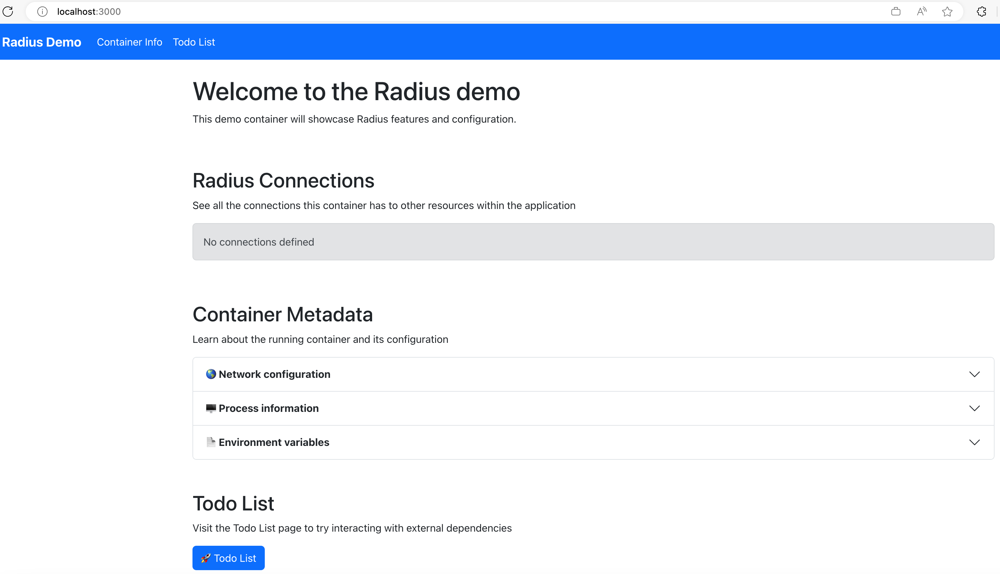

This how-to guide will provide an overview of how to:

- Patch Radius-created Kubernetes resources using [PodSpec](https://kubernetes.io/docs/reference/kubernetes-api/workload-resources/pod-v1/#PodSpec) definitions

## Prerequisites

- [rad CLI]()
- [Radius initialized with `rad init`]()
- [kubectl](https://kubernetes.io/docs/tasks/tools/install-kubectl/)

## Step 1: Define a container

Begin by creating a file named `app.bicep` with a Radius [container]():



## Step 2: Deploy the app and container

1. Deploy and run your app:

   ```bash
   rad run ./app.bicep -a demo
   ```

   Once the deployment completes successfully, you should see the following confirmation message along with some system logs:

   ```
   Deployment Complete

   Resources:
      demo            Applications.Core/applications
      demo            Applications.Core/containers

   Starting log stream...

   + demo-df76d886c-sngm8 › demo
   demo-df76d886c-sngm8 demo Using in-memory store: no connection string found
   demo-df76d886c-sngm8 demo Server is running at http://localhost:3000
   demo-df76d886c-sngm8 demo [port-forward] connected from localhost:3000 -> ::3000
   ```

   Access the application by opening [http://localhost:3000](http://localhost:3000) in a browser, where you should see the demo app:

   

   <br> When you're ready to move on to the next step, use `CTRL` + `C` to exit the command.

2. Run the command below, which will list the pods in your Kubernetes cluster, using the `-o` flag to specify the relevant information to output:


   ```bash
   kubectl get pods -A -l app.kubernetes.io/name=demo -o custom-columns=POD:.metadata.name,STATUS:.status.phase,CONTAINER_NAMES:spec.containers[:].name,CONTAINER_IMAGES:spec.containers[:].image
   ```

   You should see output confirming that a single container named `demo` was deployed and is running in your pod, similar to the following:

   ```
   POD                    STATUS    CONTAINER_NAMES   CONTAINER_IMAGES
   demo-df76d886c-9p4gv   Running   demo              ghcr.io/radius-project/samples/demo:latest
   ```

## Step 3: Add a PodSpec to the container definition

Add the following [`runtimes`]() configuration to the container definition in your `app.bicep` file. This allows you to punch through the Radius abstraction and directly apply any part of the Kubernetes PodSpec. In this example you're adding an additional sidecar container:

{{< rad file="snippets/patch-runtime.bicep" embed=true markdownConfig="{linenos=table,hl_lines=[\"25-37\"]}" >}}

> Remember to save your `app.bicep` file after you've made the above changes.

## Step 4: Redeploy your app with the PodSpec added

1. Deploy and run your app again:

   ```bash
   rad run ./app.bicep -a demo
   ```

   Once the deployment completes successfully, you should see the same deployment completion confirmation message as before, but this time with some system logs from `log-collector` streaming to your console output:

   ```
   Starting log stream...

   + demo-547d7dc77f-nmqpk › log-collector
   + demo-547d7dc77f-nmqpk › demo
   demo-547d7dc77f-nmqpk log-collector Fluent Bit v2.1.8
   demo-547d7dc77f-nmqpk log-collector * Copyright (C) 2015-2022 The Fluent Bit Authors
   demo-547d7dc77f-nmqpk log-collector * Fluent Bit is a CNCF sub-project under the umbrella of Fluentd
   demo-547d7dc77f-nmqpk log-collector * https://fluentbit.io
   demo-547d7dc77f-nmqpk log-collector
   ```

   Access the application by opening [http://localhost:3000](http://localhost:3000) in a browser, where you should see the demo app again unchanged from before:

   

   <br> When you're ready to move on to the next step, use `CTRL` + `C` to exit the command.

2. Run the command below, which will list the pods in your Kubernetes cluster, using the `-o` flag to specify the relevant information to output:

   ```bash
   kubectl get pods -A -l app.kubernetes.io/name=demo -o custom-columns=POD:.metadata.name,STATUS:.status.phase,CONTAINER_NAMES:spec.containers[:].name,CONTAINER_IMAGES:spec.containers[:].image
   ```

   You should now see in the output the original `demo` app container as before, but also an additional `log-collector` container that is running in your pod, similar to the following:

   ```
   POD                     STATUS    CONTAINER_NAMES      CONTAINER_IMAGES
   demo-547d7dc77f-nmqpk   Running   log-collector,demo   ghcr.io/radius-project/fluent-bit:2.1.8,radius.azurecr.io/tutorial/webapp:latest
   ```

   Note that you might see old pods with a state of `Terminating` in the output - this is normal and you should see them disappear once the redeployment completes cleaning up the old resources.

   The `log-collector` container was deployed using the PodSpec definition you added to your `app.bicep` file in the `runtimes` property you added, and is now running alongside your original `demo` app container.

## Cleanup

Run the following command to [delete]() your app and container:
   
   ```bash
   rad app delete demo
   ```

## Further reading

- [Kubernetes in Radius containers]()
- [PodSpec in Radius containers]()