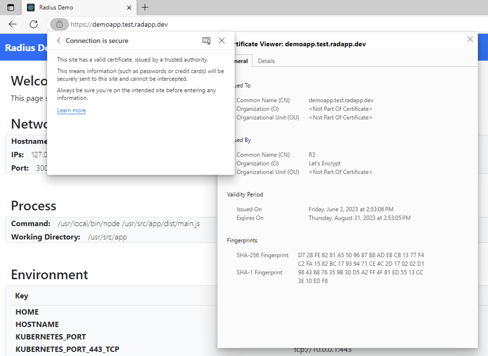

This guide will show you how to integrate Radius with cert-manager and Let's Encrypt to enable HTTPS for your application.

## Prerequisites

- [rad CLI]()
- [kubectl CLI](https://kubernetes.io/docs/tasks/tools/)
- Domain name + DNS A-record: In order to setup TLS communication to Radius you will need to make sure you have a domain name and DNS A-record pointing to your Kubernetes cluster's IP address. This is required for Let's Encrypt to issue a certificate and for traffic to be routed to your application.
   - If running Radius on an Azure Kubernetes Service (AKS) cluster you can optionally use a [DNS label](https://learn.microsoft.com/azure/virtual-network/ip-services/public-ip-addresses#dns-name-label) to create a DNS A-record pointing to your cluster. Refer to the [tips and tricks](#using-an-azure-dns-label) section for more information.
   - If running Radius on an Elastic Kubernetes Service (EKS) cluster you can optionally leverage [Application Load Balancer](https://docs.aws.amazon.com/eks/latest/userguide/alb-ingress.html) for a hosted DNS name and record.

## Step 1: Initialize a Radius Environment

Begin by running `rad init` to initialize the Radius Environment.

```sh
rad init
```

## Step 2: Set up domain

You'll next need a DNS record to point to your Kubernetes cluster and service in order to issue the certificate and allow traffic to your application.

1. Run the following command and copy the EXTERNAL-IP field:
    ```sh
    $ kubectl get svc -n radius-system contour-envoy
    NAME            TYPE           CLUSTER-IP    EXTERNAL-IP    PORT(S)                      AGE
    contour-envoy   LoadBalancer   10.0.10.1     <EXTERNAL-IP>  80:31734/TCP,443:32517/TCP   67m
    ```

1. Configure your DNS server with an A record for your domain name and external IP address. Refer to your DNS provider for instructions on how to configure this.

## Step 3: Install cert-manager

Next, run the following command to install [cert-manager](https://cert-manager.io/):

```sh
kubectl apply -f https://github.com/jetstack/cert-manager/releases/download/v1.5.4/cert-manager.yaml
```

> You can also use other supported installation methods, such as Helm, to install cert-manager. [Instructions here](https://cert-manager.io/docs/installation/#getting-started).

## Step 4: Set up HTTP-01 Challenge

To use Let's encrypt, you need to configure the [ACME Issuer](https://cert-manager.io/docs/configuration/acme/) using cert-manager. This how-to uses an [HTTP-01 Challenge](https://cert-manager.io/docs/configuration/acme/http01/) to verify that a client owns a domain.

Here is what your HTTP-01 ACME ClusterIssuer resource should look like:



> Note that this guide shows how to set up a certificate using Let's Encrypt prod. For testing purposes you can change this to the [staging endpoint](https://letsencrypt.org/docs/staging-environment/), but you may get validation errors in your browser.

## Step 5: Create a Certificate resource

1. Create a file `certificate.yaml` with the following data, replacing the placeholders as necessary:

    

1. Then create `tls-delegation.yaml` with the following data.

    

1. Run the following commands to create the certificate resource and authorize Radius to access the resource:

    ```sh
    kubectl apply -f certificate.yaml
    kubectl apply -f tls-delegation.yaml
    ```

    You may need to wait a minute or two for cert-manager to authorize with Let's Encrypt and create the secret on the cluster. Once this process completes, you should see a secret called `demo-secret` in the default namespace. This secret is managed by cert-manager.

## Step 6: Define a Radius Application and gateway

Create a file named `app.bicep` with the following contents. Note that we reference the `demo-secret` and reference the Secret Store in the Gateway to enable TLS termination.



## Step 7: Deploy the application

Deploy the application to your environment with `rad deploy`:

```sh
rad deploy app.bicep
```

Once the deployment is complete the public endpoint of your application will be printed. Navigate to this public endpoint to access the application via HTTPS. You can view the certificate to see it has a Let's Encrypt issuer:



## Tips and tricks

### Using an Azure DNS label

If you are running Radius on an Azure Kubernetes Service (AKS) cluster you can use a [DNS label](https://learn.microsoft.com/azure/virtual-network/ip-services/public-ip-addresses#dns-name-label) to create a DNS A-record pointing to your cluster. This is useful if you don't have a domain name or don't want to use a subdomain for your dev/test environments.

To setup a DNS label for your AKS cluster:

1. Open the Azure portal to the subscription where your AKS cluster is deployed.
1. Open the resource group, prefixed with `MC_`, that contains your AKS cluster. (_i.e. `MC_myrg-mycluster_westus3`_)
1. Select the Public IP address prefixed with `kubernetes-` (_i.e. `kubernetes-a6925d5f55dfa41419c3c93648dbb30a`_)
1. Select 'Configuration' and add a DNS name label. Click save to create the DNS A-record.
1. Update your Radius gateway to use the DNS label as the `fullyQualifiedHostname` value.
