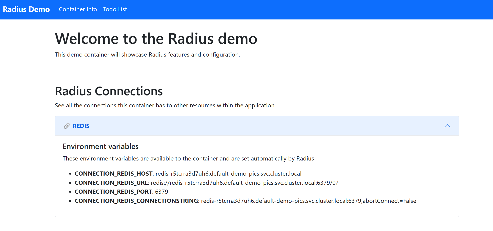

This guide will teach you how to author a portable resource for your [Radius Application]().

### Prerequisites

Before you get started, you'll need to make sure you have the following tools and resources:
- [rad CLI]()
- [Radius environment]()
- [Radius Bicep VSCode extension]()

## Step 1: Define a container resource

Create a Bicep file `app.bicep`, add a container resource that will be leveraged by your portable resource later:



## Step 2: Define your portable resource



{}

Recipes enable a separation of concerns between infrastructure operators and developers by automating infrastructure deployment. To learn more visit the [Recipes overview]()

{}

{}

Find the schema needed for the supported Radius resource by visiting the [Radius resource schema docs](). For this example you can follow along and define a RedisCache resource:



{}



## Step 3: Accessing your portable resource

Users can leverage their portable resources and establish connections to their container resources by adding accessing properties:

{{< rad file="snippets/app-redis-manual.bicep" embed=true marker="//CONTAINER" markdownConfig="{linenos=table,hl_lines=[\"19-22\"]}">}}

## Step 4: Deploy your app

1. Run your application in your environment:

    ```bash
    rad run ./app.bicep -a demo
    ```

1. Visit [localhost:3000](http://localhost:3000) in your browser. You should see the following page, now showing injected environment variables:

   

## Cleanup

Run `rad app delete` to cleanup your Radius application, container, and Redis cache:

```bash
rad app delete -a demo
```

## Further reading

- [Portable resource overview]()
- [Radius Application overview]()
