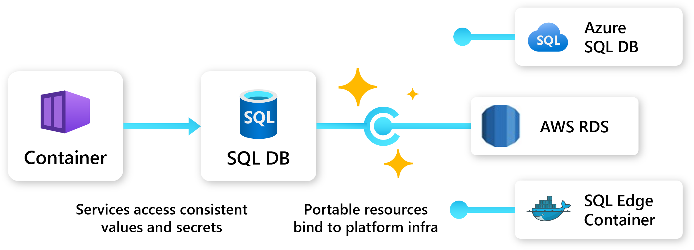

## Overview

Portable resources provide **abstraction** and **portability** to Radius Applications. This allows development teams to depend on high level resource types and APIs, and let infra teams swap out the underlying resource and configuration.

## Available resources

The following portable resources are available to use within your application:

- [`Applications.Core/extenders`]()
- [`Applications.Datastores/mongoDatabases`]()
- [`Applications.Datastores/redisCaches`]()
- [`Applications.Datastores/sqlDatabases`]()
- [`Applications.Dapr/pubSubBrokers`]()
- [`Applications.Dapr/secretStores`]()
- [`Applications.Dapr/stateStores`]()
- [`Applications.Messaging/rabbitmqQueues`]()

## Reference

Refer to the [API reference docs]() to learn more about the Radius API and the available portable resources plus their schema