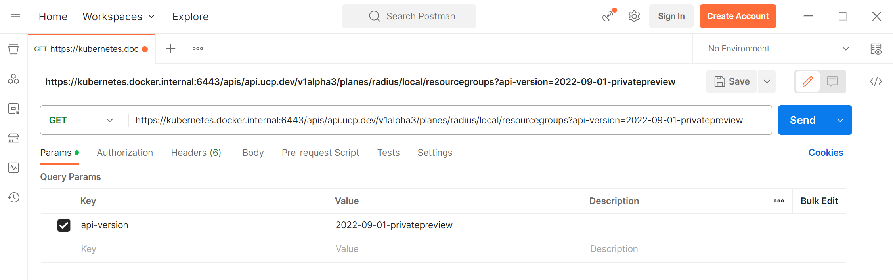
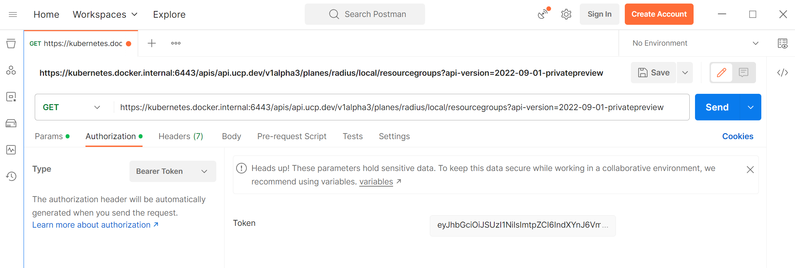

This guide will show you how to use [Postman](https://postman.com) to interact with the Radius API. Postman is a popular tool for interacting with REST APIs, and it can be used to explore the Radius API without writing any code.

### Prerequisites

Before you get started, you'll need to make sure you have the following tools and resources:

- [Postman](https://www.postman.com/)
- [kubectl](https://kubernetes.io/docs/tasks/tools/install-kubectl/)
- [Radius initialized with `rad init`](https://docs.radapp.dev/getting-started/)

### Step 1: Create Kubernetes objects

Radius uses the [Kubernetes API aggregation layer](https://kubernetes.io/docs/concepts/extend-kubernetes/api-extension/apiserver-aggregation/) to expose its API, so while Radius is not a Kubernetes operator itself, it leverages the Kubernetes platform to expose its own API.

To access the Radius API, begin by creating the necessary Kubernetes objects.

1. Create a new file named `postman.yaml` and add the following contents:

    ```yaml
    apiVersion: v1
    kind: ServiceAccount
    metadata:
      name: postman-account
      namespace: radius-system
    ---
    apiVersion: rbac.authorization.k8s.io/v1
    kind: ClusterRole
    metadata:
      name: postman-role
      namespace: radius-system
    rules:
      - apiGroups: ["", "api.ucp.dev"]
        resources: ["*"]
        verbs: ["*"]
    ---
    apiVersion: rbac.authorization.k8s.io/v1
    kind: ClusterRoleBinding
    metadata:
      name: postman-role-binding
      namespace: radius-system
    subjects:
      - kind: ServiceAccount
        name: postman-account
        namespace: radius-system
    roleRef:
      kind: ClusterRole
      name: postman-role
      apiGroup: rbac.authorization.k8s.io
    ```

1. Save the file and then apply it using the following command:

    ```bash
    kubectl apply -f postman.yaml
    ```

    This will create a `ServiceAccount` named `postman-account`, a `ClusterRole` named `postman-role` with full access to all `api.ucp.dev` resources, and a `ClusterRoleBinding` named `postman-role-binding` that binds the `postman-account` to the `postman-role`.

### Step 2: Generate a token

Now that you have created the necessary Kubernetes objects, you can generate a token that can be used to authenticate to the Kubernetes API.

1. Run the following command to generate a token for the `postman-account` service account:

    ```bash
    kubectl create token postman-account -n radius-system 
    ```

    This will create a token with the default expiration time of 1 hour. If you want to set a different expiration time, you can use the `--duration` flag to specify a duration in seconds (up to 48 hours).

### Step 3: Use Postman

Next, you'll need to get the control plane API endpoint and use Postman to interact with the Radius API.

1. Begin by getting your cluster endpoint:

    ```bash
    kubectl cluster-info
    ```

    This will output information about your Kubernetes cluster, including the control plane API endpoint:

    ```
    Kubernetes control plane is running at https://kubernetes.docker.internal:6443
    CoreDNS is running at https://kubernetes.docker.internal:6443/api/v1/namespaces/kube-system/services/kube-dns:dns/proxy
    ```

1. Open Postman and create a new request
1. Set the method to `GET`
1. Set the URL to the following, which will [retrieve all your resource groups]():
    
    ```
    <your-cluster-control-plane>/apis/api.ucp.dev/v1alpha3/planes/radius/local/resourcegroups?api-version=2022-09-01-privatepreview
    ```

    
    
1. Open the `Authorization` tab and select `Bearer Token` from the `Type` dropdown. Paste the token you generated in step 2 into the `Token` field:

   

1. Click the `Send` button to send the request. You will now see your resource groups:

   ```
   {
       "value": [
           {
               "id": "/planes/radius/local/resourcegroups/default",
               "location": "global",
               "name": "default",
               "tags": {},
               "type": "System.Resources/resourceGroups"
           }
       ]
   }
   ```
1. Update your request URL to [list all the Radius environments]() in your resource group (_make sure to update the name of your resource group in the URL. In this example the resource group name is default_):

   ```
   <your-cluster-control-plane>/apis/api.ucp.dev/v1alpha3/planes/radius/local/resourcegroups/default/providers/Applications.Core/environments?api-version=2023-10-01-preview
   ```

    You should now see your Radius environment(s):

    ```
    {
        "value": [
            {
                "id": "/planes/radius/local/resourcegroups/default/providers/Applications.Core/environments/default",
                "location": "global",
                "name": "default",
                "properties": {
                    "compute": {
                        "kind": "kubernetes",
                        "namespace": "default"
                    },
                    "provisioningState": "Succeeded",
                    "recipes": {...},
                },
                "systemData": {...},
                "tags": {},
                "type": "Applications.Core/environments"
            }
        ]
    }
    ```


## Next step: Explore the Radius API

Now that you have successfully authenticated to the Radius API and interacted with resources, you can explore the API using the [Radius API reference]().
