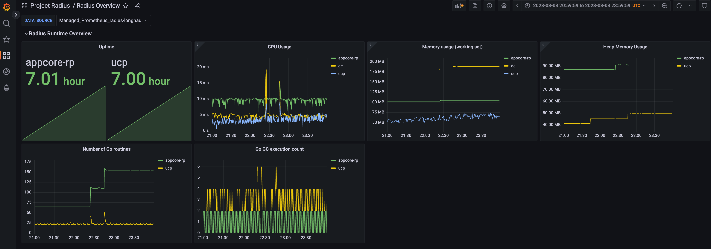
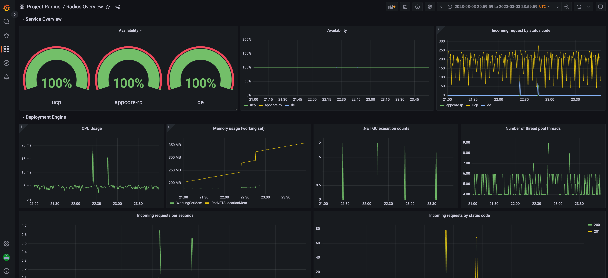
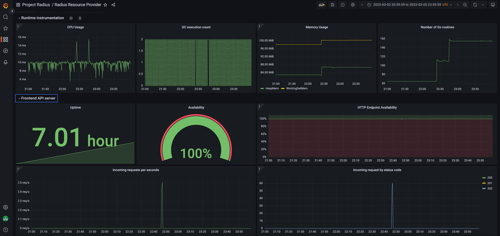
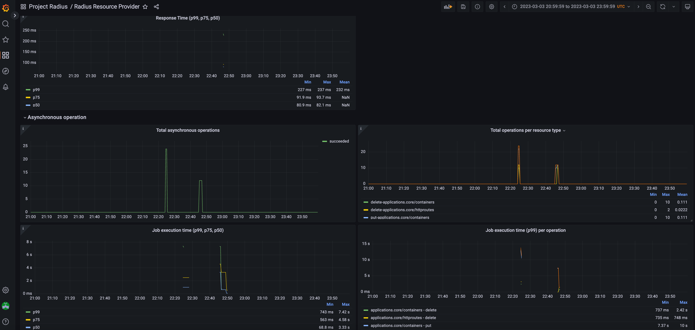

[Grafana](https://grafana.com/) is an open source visualization and analytics tool that allows you to query, visualize, alert on, and explore your metrics. This guide will show you how to install Grafana and configure it to visualize the Radius control plane metrics from Prometheus.

## Example dashboards

There are two example dashboards that you can import into Grafana to quickly get started visualizing your metrics and then customize them to meet your needs.

### Control plane overview

The [radius-overview-dashboard.json](https://raw.githubusercontent.com/radius-project/radius/main/grafana/radius-overview-dashboard.json) template shows Radius and Deployment Engine statuses, including runtime, and server-side health:

<br/>

<br/>

### Resource provider overview

The [radius-resource-provider-dashboard.json](https://raw.githubusercontent.com/radius-project/radius/main/grafana/radius-resource-provider-dashboard.json) template shows Radius Resource Provider status, including runtime, server-side, and operations health:

<br/>

<br/>

## Setup on Kubernetes

### Pre-requisites

- [Setup Prometheus]() on your Kubernetes cluster
- [Helm 3](https://helm.sh/)


### Install Grafana

1. Add the Grafana Helm repo:

   ```bash
   helm repo add grafana https://grafana.github.io/helm-charts
   helm repo update
   ```

1. Install the chart:

   ```bash
   helm install grafana grafana/grafana -n radius-monitoring
   ```

   If you are Minikube user or want to disable persistent volume for development purpose, you can disable it by using the following command instead:

   ```bash
   helm install grafana grafana/grafana -n radius-monitoring --set persistence.enabled=false
   ```

1. Retrieve the admin password for Grafana login:

   ```bash
   kubectl get secret --namespace radius-monitoring grafana -o jsonpath="{.data.admin-password}" | base64 --decode ; echo
   ```

   You will get a password similar to `cj3m0OfBNx8SLzUlTx91dEECgzRlYJb60D2evof1%`. Remove the `%` character from the password to get `cj3m0OfBNx8SLzUlTx91dEECgzRlYJb60D2evof1` as the admin password.

1. Validate that Grafana is running in your cluster:

   ```bash
   kubectl get pods -n radius-monitoring
   ```
   You should see something similar to the following:

   ```
   NAME                        READY   STATUS       RESTARTS   AGE
   grafana-c49889cff-x56vj     1/1     Running      0          5m10s
   ...
   ```

### Configure Prometheus as data source

Now that Grafana is installed, you need to configure it to use Prometheus as a data source.

1. Port-forward to your Grafana service:

   ```bash
   kubectl port-forward svc/grafana 8080:80 -n radius-monitoring
   ```

1. Open a browser to [`http://localhost:8080`](http://localhost:8080)

1. Login to Grafana
   - Username: `admin`
   - Password: Password from above

1. Select `Configuration` and `Data Sources`

1. Add Prometheus as a data source.

1. Get your Prometheus HTTP URL:

   The Prometheus HTTP URL follows the format `http://<prometheus service endpoint>.<namespace>`

   Start by getting the Prometheus server endpoint by running the following command:

   ```bash
   kubectl get svc -n radius-monitoring
   ```

   You should see something similar to the following:

   ```
   NAME                                     TYPE        CLUSTER-IP        EXTERNAL-IP   PORT(S)             AGE
   radius-prom-kube-state-metrics           ClusterIP   10.0.174.177      <none>        8080/TCP            7d9h
   radius-prom-prometheus-alertmanager      ClusterIP   10.0.255.199      <none>        80/TCP              7d9h
   radius-prom-prometheus-node-exporter     ClusterIP   None              <none>        9100/TCP            7d9h
   radius-prom-prometheus-pushgateway       ClusterIP   10.0.190.59       <none>        9091/TCP            7d9h
   radius-prom-prometheus-server            ClusterIP   10.0.172.191      <none>        80/TCP              7d9h
   grafana                                  ClusterIP   10.0.15.229       <none>        80/TCP              5d5h
   ```

   In this example the server name is `radius-prom-prometheus-server` and the namespace is `radius-monitoring`, so the HTTP URL will be `http://radius-prom-prometheus-server.radius-monitoring`.

1. Fill in the following settings:

   - Name: `Radius`
   - HTTP URL: `http://radius-prom-prometheus-server.radius-monitoring`
   - Default: On

1. Click `Save & Test` button to verify that the connection succeeded.

### Import dashboards in Grafana

1. Download the Grafana dashboard templates:
   - [radius-overview-dashboard.json](https://raw.githubusercontent.com/radius-project/radius/main/grafana/radius-overview-dashboard.json) 
   - [radius-resource-provider-dashboard.json](https://raw.githubusercontent.com/radius-project/radius/main/grafana/radius-resource-provider-dashboard.json)
1. In the upper left corner of the Grafana home screen, click the "+" option, then "Import", and select your templates.
1. Select the dashboard that you imported and enjoy!

## References

* [Prometheus Installation](https://github.com/prometheus-community/helm-charts)
* [Prometheus on Kubernetes](https://github.com/coreos/kube-prometheus)
* [Prometheus Query Language](https://prometheus.io/docs/prometheus/latest/querying/basics/)
