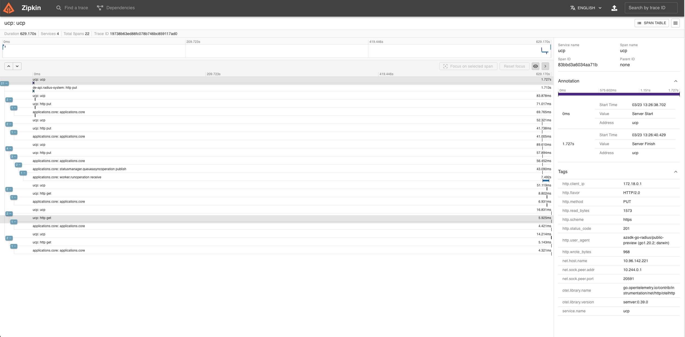

[Zipkin](https://zipkin.io/) is an open source distributed tracing system. It helps gather timing data needed to troubleshoot latency problems in microservice architectures. It manages both the collection and lookup of this data.

The following steps show you how to configure the [Radius control plane]() components to send distributed tracing data to Zipkin running as a container in your Kubernetes cluster and how to view the data.

## Pre-requisites

- [kubectl CLI](https://kubernetes.io/docs/tasks/tools/)

## Step 1: Install Zipkin on Kubernetes

1. Create the namespace `radius-monitoring`:

   ```bash
   kubectl create namespace radius-monitoring
   ```

2. Deploy the Zipkin deployment and service:

   ```bash
   kubectl create deployment zipkin --image openzipkin/zipkin -n radius-monitoring
   ```

   ```bash
   kubectl expose deployment zipkin --type ClusterIP --port 9411 -n radius-monitoring
   ```

## Step 2: Configure Radius control plane

1. Install the Radius control plane with your Zipkin endpoint set using [`rad install kubernetes`]():

   ```bash
   rad install kubernetes --set  global.zipkin.url=http://zipkin.radius-monitoring.svc.cluster.local:9411/api/v2/spans
   ```

   > **Note:** `http://zipkin.radius-monitoring.svc.cluster.local:9411/api/v2/spans` is the default URL for Zipkin when installed using the above instructions. If you have changed the service name or namespace, use that instead.

## Step 3: View Tracing Data

1. Port forward the Zipkin service to your local machine:

   ```bash
   kubectl port-forward svc/zipkin 9411:9411 -n radius-monitoring
   ```

2. In your browser, go to [http://localhost:9411](http://localhost:9411) to see the Zipkin UI and run a query:

   

3. Done! You can now use the Zipkin UI to view tracing data for your Radius control plane.

## References

- [Zipkin for distributed tracing](https://zipkin.io/)
