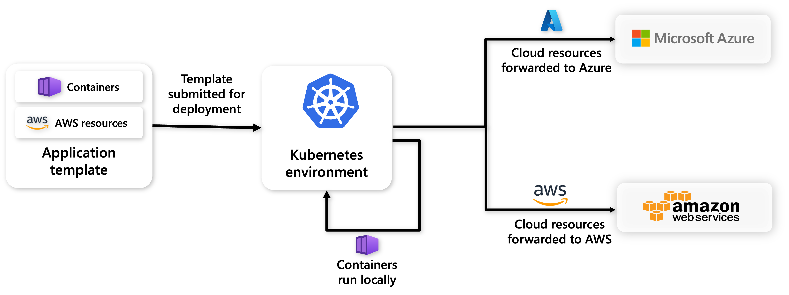

Radius cloud providers allow you to deploy and connect to cloud resources across various cloud platforms. For example, you can use the Radius Azure provider to run your application's services in your Kubernetes cluster, while deploying Azure resources to a specified Azure subscription and resource group.

## Supported cloud providers

| Provider | Description |
|----------|-------------|
| [Microsoft Azure](#azure-provider) | Deploy and connect to Azure resources |
| [Amazon Web Services](#aws-provider) | Deploy and connect to AWS resources |
