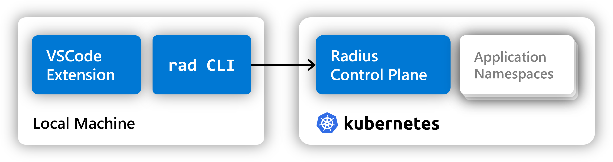

Radius consists of a set of tools and services that together form the Radius platform.

## Step 1: Install the rad CLI



## Step 2: Install the Radius-Bicep VS Code extension



## Step 3: Initialize the Radius control-plane and the Radius environment



>If you are looking to upgrade Radius to the latest version, refer to [upgrade Radius on Kubernetes]() for more information.