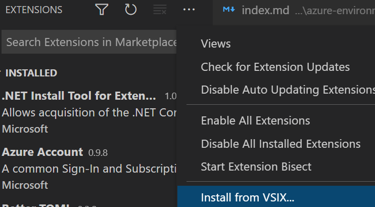

### Install the rad CLI

The rad CLI is the main tool for interacting with Radius. It is used to create and manage Radius environments, and to deploy and manage Radius applications.

The `rad` CLI manages your applications, resources, and environments. You can install it on your local machine with the following installation scripts:


{}

```bash
curl -fsSL "https://get.radapp.dev/tools/rad/install.sh" | /bin/bash
```


To install the latest edge version:

```bash
curl -fsSL "https://radiuspublic.blob.core.windows.net/tools/rad/install.sh" | /bin/bash -s edge
```

{}

{}

```bash
wget -q "https://get.radapp.dev/tools/rad/install.sh" -O - | /bin/bash
```


To install the latest edge version:

```bash
wget -q "https://radiuspublic.blob.core.windows.net/tools/rad/install.sh" -O - | /bin/bash -s edge
```

{}

{}

Run the following in a PowerShell window:

```powershell
iwr -useb "https://get.radapp.dev/tools/rad/install.ps1" | iex
```

You may need to refresh your $PATH environment variable to access `rad`:
```powershell
$Env:Path = [System.Environment]::GetEnvironmentVariable("Path","User")
```


To install the latest edge version:

```powershell
$script=iwr -useb  https://radiuspublic.blob.core.windows.net/tools/rad/install.ps1; $block=[ScriptBlock]::Create($script); invoke-command -ScriptBlock $block -ArgumentList edge
```

{}

{}
[Azure Cloud Shell](https://docs.microsoft.com/en-us/azure/cloud-shell/overview) is an interactive, authenticated, browser-accessible shell for managing Azure resources.

Azure Cloud Shell for bash doesn't have a sudo command, so users are unable to install Radius to the default `/usr/local/bin` installation path. To install the rad CLI to the home directory, run the following commands:

```bash
export RADIUS_INSTALL_DIR=./
wget -q "https://get.radapp.dev/tools/rad/install.sh" -O - | /bin/bash
```

You can now run the rad CLI with `./rad`.

PowerShell for Cloud Shell is currently not supported.
{}

{}
1. Download the `rad` CLI from one of these URLs:
   - MacOS x64: https://get.radapp.dev/tools/rad//macos-x64/rad
   - MacOS arm64: https://get.radapp.dev/tools/rad//macos-arm64/rad
   - Linux x64: https://get.radapp.dev/tools/rad//linux-x64/rad
   - Windows x64: https://get.radapp.dev/tools/rad//windows-x64/rad.exe
1. Ensure the user has permission to execute the binary and place it somewhere on your PATH so it can be invoked easily.
{}



> You may be prompted for your sudo password during installation, as the installer places the `rad` binary under `/usr/local/bin`. If you are unable to sudo you can install the rad CLI to another directory by setting the `RADIUS_INSTALL_DIR` environment variable with your intended install path. Make sure you add this to your path ([Unix](https://www.howtogeek.com/658904/how-to-add-a-directory-to-your-path-in-linux/), [Windows](https://windowsloop.com/how-to-add-to-windows-path/)) if you wish to reference it via `rad`, like in the docs.

Verify the rad CLI is installed correctly by running `rad`.

### Install the VS Code extension

The Radius-Bicep VS Code extension provides a set of tools for working with Bicep files in VS Code.

Visual Studio Code offers the best authoring experience for Radius and Bicep. Download and install the Radius Bicep extension to easily author and validate Bicep templates:

1. Download the latest extensions

   

   {}
   

   
   
   
   {}

   {}

   Stable Version

   ```bash
   curl https://get.radapp.dev/tools/vscode-extensibility/stable/rad-vscode-bicep.vsix --output rad-vscode-bicep.vsix
   ```

   Edge Version

   ```bash
   curl https://get.radapp.dev/tools/vscode-extensibility/edge/rad-vscode-bicep.vsix --output rad-vscode-bicep.vsix
   ```

   {}

   

2. Install the `.vsix` file:

   

   {}
   In VSCode, manually install the extension using the *Install from VSIX* command in the Extensions view command drop-down.

   

   {}

   {}
   You can also import this extension on the [command-line](https://code.visualstudio.com/docs/editor/extension-gallery#_install-from-a-vsix) with:

   ```bash
   code --install-extension rad-vscode-bicep.vsix
   ```

   If you're on macOS, make sure to [setup the `code` alias](https://code.visualstudio.com/docs/setup/mac#_launching-from-the-command-line).

   {}

   

3. **Disable the official Bicep extension** if you have it installed. Do not install it if prompted, our custom extension needs to be responsible for handling `.bicep` files and you cannot have both extensions enabled at once.

4. If running on Windows Subsystem for Linux (WSL), make sure to install the extension in WSL as well:

   

### Initialize the Radius environment

The Radius control-plane is a set of services that provide the core functionality of Radius. It is deployed as a set of containers in a Kubernetes cluster.

Initialize a new [Radius environment]() with [`rad init`]():

   ```bash
   rad init
   ```
   
   Select `Yes` to setup the app.bicep in the current directory

   ```
   Initializing Radius...                                                
                                                                      
   🕔 Install Radius                                              
      - Kubernetes cluster: kind
      - Kubernetes namespace: radius-system                              
   ⏳ Create new environment default                                     
      - Kubernetes namespace: default                                    
      - Recipe pack: local-dev                                                 
   ⏳ Scaffold application                                          
   ⏳ Update local configuration                                                 
   ```                                             

2. Verify the initialization by running:
   ```bash
   kubectl get deployments -n radius-system
   ```

   You should see:

   ```
   NAME                      READY   UP-TO-DATE   AVAILABLE   AGE
   ucp                       1/1     1            1           53s
   appcore-rp                1/1     1            1           53s
   bicep-de                  1/1     1            1           53s
   contour-contour           1/1     1            1           46s
   ```

   You can also use [`rad env list`]() to view your environment:
   
   ```bash
   rad env list
   ```
