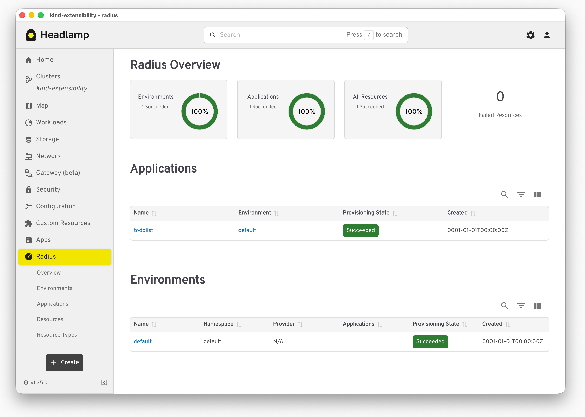

Radius integrates with [Headlamp](https://headlamp.dev/), an open-source Kubernetes web UI maintained under [Kubernetes SIGs](https://github.com/kubernetes-sigs/headlamp), through a community-maintained plugin. The plugin adds a **Radius** section to the Headlamp sidebar so you can browse Radius applications, environments, resources, and resource types alongside your Kubernetes workloads in a single interface.

This guide explains what the plugin provides, how the integration works, and how to install and use it.

## What the plugin provides

The plugin adds the following views to Headlamp:

- **Overview dashboard:** A summary of all Radius resources in the cluster, with status breakdowns for succeeded, failed, processing, and suspended resources.
- **Applications:** A list of Radius Applications, with detail views showing environment configuration, associated resources, and system metadata.
- **Environments:** Radius Environments and their compute configuration.
- **Resources:** Resources across Radius namespaces such as `Radius.Core`, `Radius.Compute`, `Radius.Data`, and `Radius.Messaging`, with provisioning state indicators.
- **Resource Types:** The Radius Resource Types registered in your cluster, including API versions, schemas, and properties.

Each resource displays a status label that maps Radius provisioning states to Headlamp's built-in visual indicators, making it easy to spot issues at a glance.

## How the integration works

Radius exposes its API through the Kubernetes API Aggregation Layer. Because of this, the plugin talks to Radius through the same Kubernetes API server that Headlamp is already connected to, without any additional proxies or API endpoints.

The flow is:

1. Headlamp connects to your Kubernetes cluster.
1. The plugin registers the Radius sidebar entries and routes.
1. When you open a Radius view, the plugin makes API calls through the Kubernetes API Aggregation Layer to the Radius UCP.
1. The UCP returns data about applications, environments, resources, and resource types, and the plugin renders it.

If you can access your cluster with Headlamp, you can see your Radius resources with no additional setup on the API side.

{}
The Headlamp plugin for Radius is a community-maintained project contributed to the [Headlamp plugins repository](https://github.com/headlamp-k8s/plugins/tree/main/radius). It is not part of the core Radius installation.
{}

## Before you begin

Before using the plugin, verify that:

- The [Radius control plane]() is installed in the Kubernetes cluster. If you have not installed Radius yet, follow the [getting started guide]().
- [Headlamp](https://headlamp.dev/docs/latest/installation/) is installed, either [in-cluster](https://headlamp.dev/docs/latest/installation/in-cluster) or as a [desktop app](https://headlamp.dev/docs/latest/installation/desktop).
- Headlamp is configured to access the same Kubernetes cluster where Radius is installed.

## Step 1: Install the plugin

The Radius plugin is published on [Artifact Hub](https://artifacthub.io/packages/headlamp/headlamp-plugins/headlamp_radius). Install it in one of two ways:

- **From the Headlamp plugin catalog:** Open Headlamp, go to the plugin catalog, search for **Radius**, and install it.
- **Manually from Artifact Hub:** Follow the [Headlamp plugin installation instructions](https://headlamp.dev/docs/latest/development/plugins/) to install the plugin from its [Artifact Hub package](https://artifacthub.io/packages/headlamp/headlamp-plugins/headlamp_radius).

After the plugin is installed, a **Radius** section appears in the Headlamp sidebar.

## Step 2: Browse your Radius resources

Select the **Radius** section in the sidebar to open the views described above. From there you can:

- Review the overall status of Radius resources on the overview dashboard.
- Open an Application to inspect its environment, associated resources, and metadata.
- Browse Environments and their compute configuration.
- List resources across Radius namespaces and check their provisioning state.
- Explore the Resource Types registered in your cluster.

## Related links

- [Headlamp documentation](https://headlamp.dev/docs/latest/)
- [Radius plugin on Artifact Hub](https://artifacthub.io/packages/headlamp/headlamp-plugins/headlamp_radius)
- [Headlamp plugins repository](https://github.com/headlamp-k8s/plugins/tree/main/radius)
