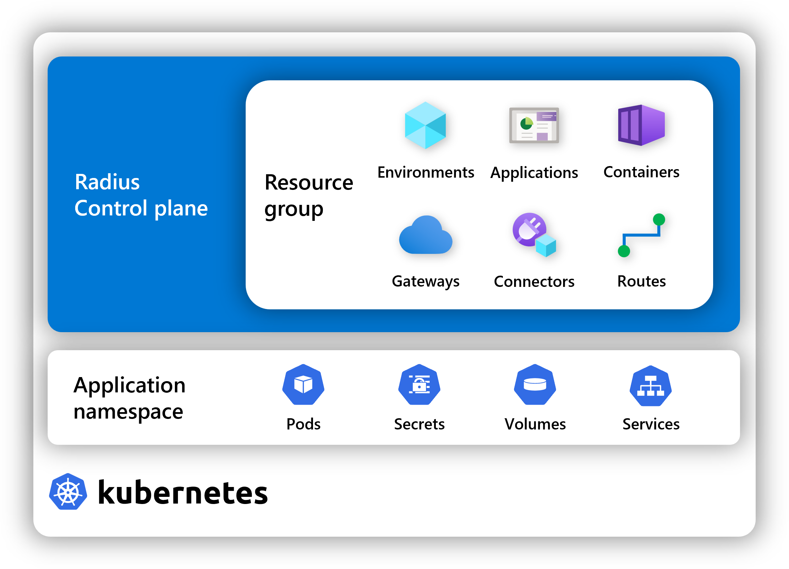

Resource groups are collections of resources that you can manage as a single unit. You can use resource groups to organize your resources when deploying Radius applications.



{}
Note that resource groups in Radius are not the same as [Azure resource groups](https://learn.microsoft.com/azure/azure-resource-manager/management/manage-resource-groups-portal). Azure resource groups are used to organize Azure resources, while Radius resource groups are used to organize Radius resources, such as applications, environments, links, and routes. When you deploy a template that contains both, Radius resources route to the Radius resource group defined in your workspace, and Azure resources route to the Azure resource group defined in your [cloud provider]().
{}

## Initialization

As part of `rad init`, a default resource group is created for you, with the same name as your environment. This resource group is set as the default 'scope' of your [workspace](), so that all Radius resources you deploy will be created in this resource group.

## Manage groups with rad CLI

The rad CLI provides commands for managing resource groups. You can use the [`rad group`]() commands to create, list, and delete groups:



{}
[rad group create]() creates a new resource group:

```bash
rad group create myrg
```
{}

{}
[rad group list]() lists all of the resource groups in your Radius installation:

```bash
rad group list
```
{}

{}
[rad group show]() prints information on a resource group:

```bash
rad group show
```
{}

{}
[rad group delete]() deletes the specified resource group:

```bash
rad group delete -e mygroup
```
{}

{}
[rad group switch]() switches the default resource group in your [workspace]():

```bash
rad group switch mygroup
```
{}



## Additional information

- [Radius API]()
- [Radius architecture]()
- [rad CLI reference]()