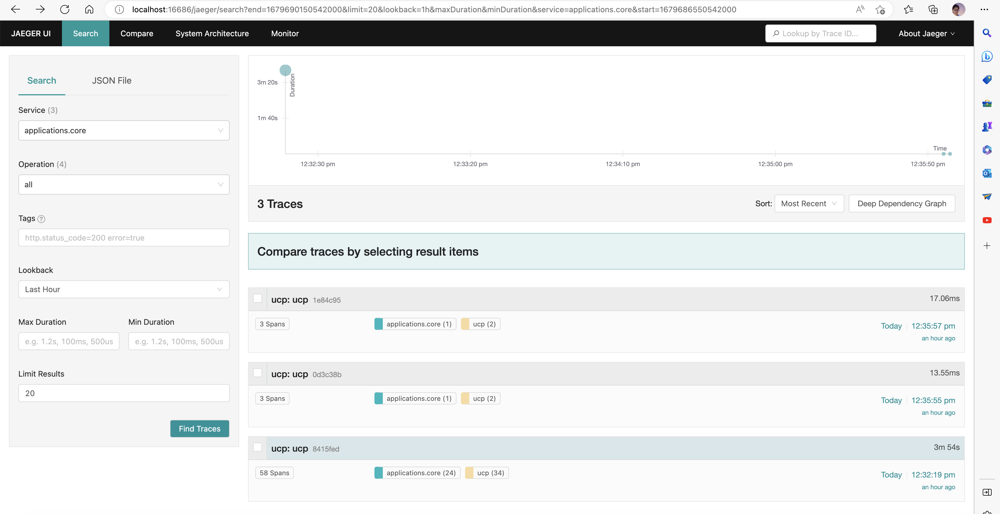

[Jaeger](https://www.jaegertracing.io/) is an open source distributed tracing system. It helps gather timing data needed to troubleshoot latency problems in microservice architectures. It manages both the collection and lookup of this data.

The following steps show you how to configure the Radius control plane to send distributed tracing data to Jaeger running as a container in your Kubernetes cluster and how to view the data.

## Step 1: Install Jaeger on Kubernetes

1. Create the namespace `radius-monitoring`:

   ```bash
   kubectl create namespace radius-monitoring
   ```

2. Create the file `jaeger.yaml`, and paste the following YAML:

   

3. Install Jaeger:

   ```bash
   kubectl apply -f jaeger.yaml
   ```

4. Wait for Jaeger to be up and running

   ```bash
   kubectl wait deploy --selector app=jaeger --for=condition=available -n radius-monitoring
   ```

## Step 2: Configure Radius control plane

1. Install the Radius control plane with your Zipkin endpoint set to your Jaeger collector endpoint using [`rad install kubernetes`]():

   ```bash
   rad install kubernetes --set  global.zipkin.url=http://jaeger-collector.radius-monitoring.svc.cluster.local:9411/api/v2/spans
   ```

   > **Note:** `http://jaeger-collector.radius-monitoring.svc.cluster.local:9411/api/v2/spans` is the default URL for Jaeger when installed using the above instructions. If you have changed the service name or namespace, use that instead.

## Step 3: View Tracing Data

1. Port forward the Jaeger service to your local machine:

   ```bash
   kubectl port-forward svc/tracing 16686 -n radius-monitoring 
   ```

2. In your browser, go to [http://localhost:16686](http://localhost:16686) to see the Jaeger UI:

   

## References

- [Jaeger Getting Started](https://www.jaegertracing.io/docs/1.21/getting-started/#all-in-one)