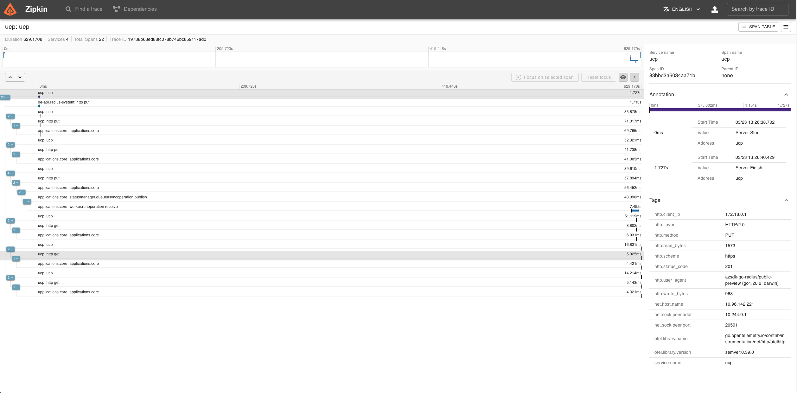

## Configure Radius


Install radius with tracing enabled by following below steps:

```
rad install kubernetes --set  global.tracerProvider.zipkin.url=zipkin_endpoint_url
```
where zipkin_endpoint_url is the endpoint of installed zipkin

For example, 
```
rad install kubernetes --set  global.tracerProvider.zipkin.url=http://zipkin.default.svc.cluster.local:9411/api/v2/spans
```

## Configure Kubernetes

The following steps shows you how to configure Dapr to send distributed tracing data to Zipkin running as a container in your Kubernetes cluster, and how to view them.

### Setup

First, deploy Zipkin:

```bash
kubectl create deployment zipkin --image openzipkin/zipkin
```

Create a Kubernetes service for the Zipkin pod:

```bash
kubectl expose deployment zipkin --type ClusterIP --port 9411
```

That's it! Your Radius control plane is now configured to send traces to Zipkin.

### Viewing Tracing Data

To view traces, connect to the Zipkin service and open the UI:

```bash
kubectl port-forward svc/zipkin 9411:9411
```

In your browser, go to `http://localhost:9411` and you will see the Zipkin UI.



## References
- [Zipkin for distributed tracing](https://zipkin.io/)
