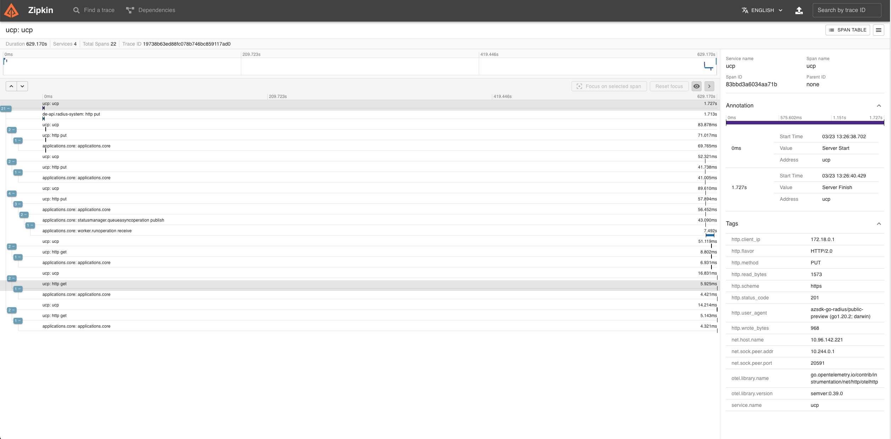

## Configure Kubernetes

The following steps show you how to configure the Radius control plane to send distributed tracing data to Zipkin running as a container in your Kubernetes cluster and how to view the data.

### Setup Zipkin

1. Create namespace `radius-monitoring`
```
kubectl create namespace radius-monitoring
```
2. Deploy Zipkin
```
kubectl create deployment zipkin --image openzipkin/zipkin -n radius-monitoring
```

Create a Kubernetes service for the Zipkin pod:
```
kubectl expose deployment zipkin --type ClusterIP --port 9411 -n radius-monitoring
```

That's it! Your Radius control plane is now configured to send traces to Zipkin.

### Configure Radius

Install radius with tracing enabled by following the steps below:

```
rad install kubernetes --set  global.tracerProvider.zipkin.url=zipkin_endpoint_url
```
where `zipkin_endpoint_url` is the endpoint of the installed instance of Zipkin
For example, 
```
rad install kubernetes --set  global.tracerProvider.zipkin.url=http://zipkin.default.svc.cluster.local:9411/api/v2/spans
```

### Viewing Tracing Data

To view traces, connect to the Zipkin service and navigate to the UI:
```
kubectl port-forward svc/zipkin 9411:9411 -n radius-monitoring
```

In your browser, go to `http://localhost:9411` and you will see the Zipkin UI.



## References
- [Zipkin for distributed tracing](https://zipkin.io/)
