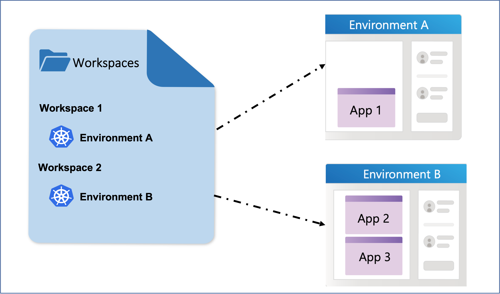

Radius enables you to handle multiple Radius environment configuration using workspaces

## Workspaces

A Workspace is a client-side functionality that enables you to save and manage your environment configurations locally. Workspaces enable you to conveniently switch between multiple environments.



A workspace contains reference to the following information

- Connection to your kubernetes cluster
- Scope for radius resources. Radius resources will be deployed into this resource group by default.
- Environment id once you have an environment initialized
- Azure cloud provider configuration if your environment has Azure cloud provider

Whenever a kubernetes environment is initialized via ```rad env init kubernetes```, a default workspace is created.

Below is a sample workspace configuration 

``` sh
workspaces:
  default: myworkspace
  items:
    myworkspace:
      connection:
        context: mycluster
        kind: kubernetes
      environment: /planes/radius/local/resourcegroups/myworkspace
      /providers/applications.core/environments/myenv
      scope: /planes/radius/local/resourceGroups/myworkspace
```
Where 
- `context` denotes the kubernetes cluster context
- `kind` denotes that the workspace is for kubernetes environments
- `scope` denotes the reference to radius planes

## Using workspaces to switch between environments

When you have multiple environments initialized for different purposes like staging or production, the workspace concepts enables you to switch between different environment configurations easily. You can create separate workspaces for each of these environments and switch between them as you are working through your deployment changes in each of the environments.

Lets take an example where you need to create two different environments and switch between them during deployments 

1. Install the Radius control plane on kubernetes cluster
    ```sh
    rad install kubernetes
    ```

1. Create a workspace with the name "radius-workspace-staging" using [`rad workspace init kubernetes`]() command
    ```sh 
    rad workspace init kubernetes -w radius-workspace-staging
    ```

1. Initialize a Radius environment via `rad env init kubernetes`

    ```sh 
    rad env init kubernetes -i
    ```
    After creating an environment, Radius writes the environment configuration details to your local configuration file `/.rad/config.yaml`

1. Verify that your config.yaml contains your workspace configuration. It should look like below

    ```bash
    workspaces:
      default: radius-workspace-staging
      items:
        radius-workspace-staging:
          connection:
            context: mycluster
            kind: kubernetes
          environment: /planes/radius/local/resourcegroups/radius-workspace-staging/
          providers/applications.core/environments/env
          scope: /planes/radius/local/resourceGroups/radius-workspace-staging
    ```

1. Create another workspace with the name "radius-workspace-production" using [`rad workspace init kubernetes`]() command
    ```sh 
    rad workspace init kubernetes -w radius-workspace-production
    ```

1. Switch to the workspace "radius-workspace-production" to initialize a new environment as rad env init picks the default and current workspace to save your configuration

    ```sh 
    rad workspace switch -w radius-workspace-production
    ```

1. Initialize another Radius environment via `rad env init kubernetes` 

    ```sh 
    rad env init kubernetes -i
    ```

1. Verify config.yaml. It should look like below with separate workspaces created for your environments
    ```sh
    workspaces:
    default: radius-workspace-production
    items:
      radius-workspace-production:
        connection:
          context: mycluster
          kind: kubernetes
        environment: /planes/radius/local/resourcegroups/radius-workspace-production
        /providers/applications.core/environments/env1
        scope: /planes/radius/local/resourceGroups/radius-workspace-production
      radius-workspace-staging:
        connection:
          context: mycluster
          kind: kubernetes
        environment: /planes/radius/local/resourcegroups/radius-workspace-staging
        /providers/applications.core/environments/env2
        scope: /planes/radius/local/resourceGroups/radius-workspace-staging
    ```

1. You can also list all of your workspaces using `rad workspace list`
    ```sh 
    rad workspace list
    ```
