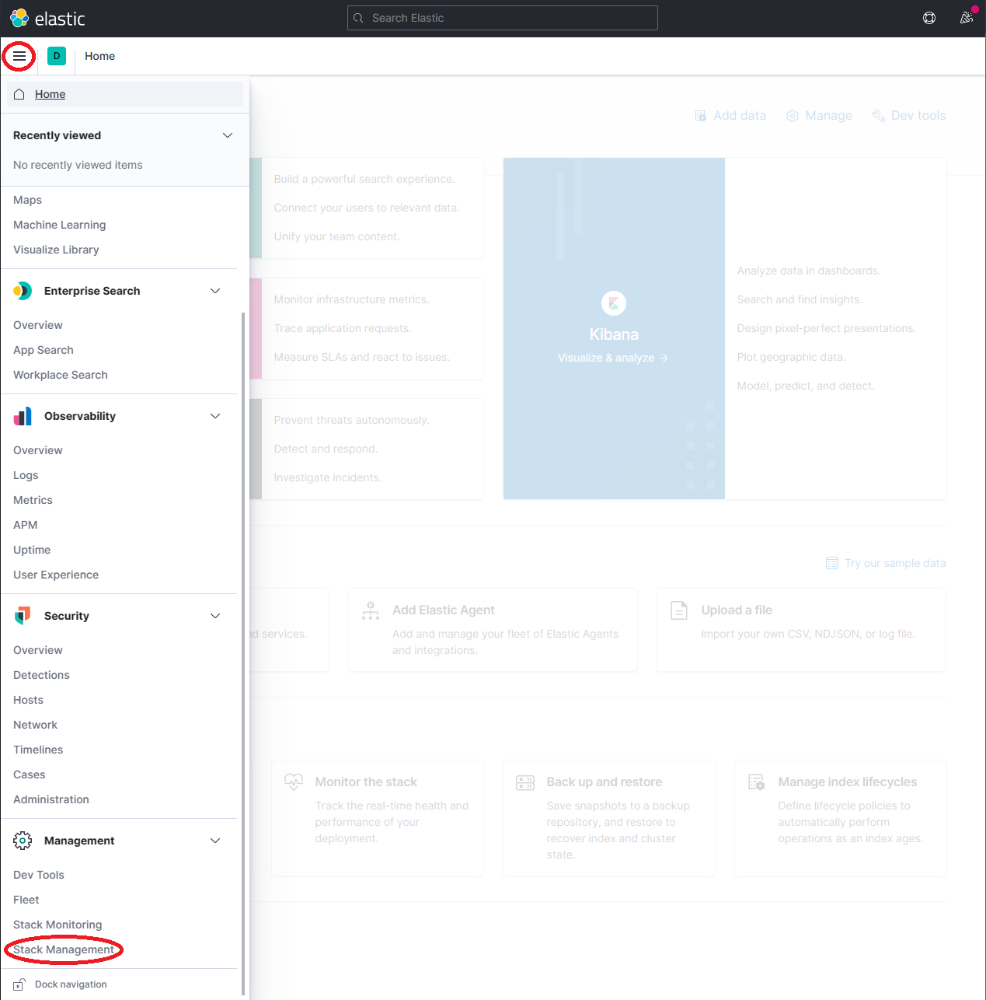
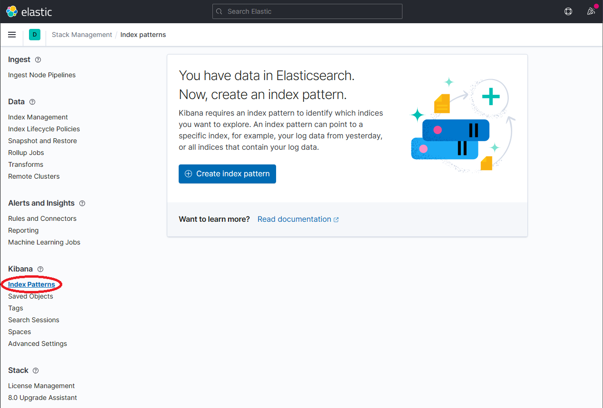
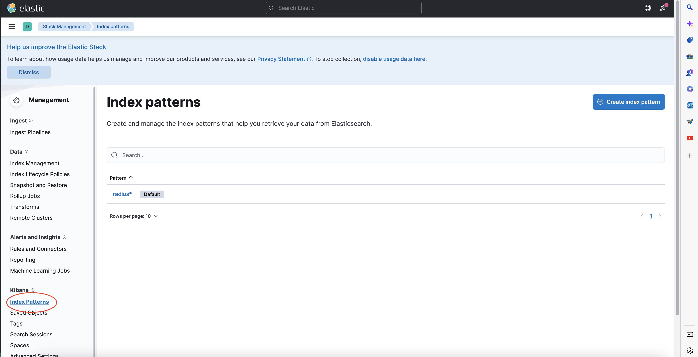
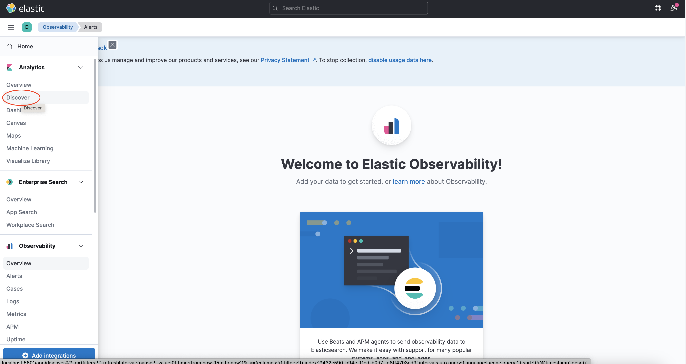

## Prerequisites

- Kubernetes (> 1.14)
- [kubectl](https://kubernetes.io/docs/tasks/tools/)
- [Helm 3](https://helm.sh/)

## Install Elastic search and Kibana

1. Create a Kubernetes namespace for monitoring tools

    ```bash
    kubectl create namespace radius-monitoring
    ```

2. Add the helm repo for Elastic Search

    ```bash
    helm repo add elastic https://helm.elastic.co
    helm repo update
    ```

3. Install Elastic Search using Helm

    By default, the chart creates 3 replicas which must be on different nodes. If your cluster has fewer than 3 nodes, specify a smaller number of replicas.  For example, this sets the number of replicas to 1:

    ```bash
    helm install elasticsearch elastic/elasticsearch --version 7.17.3 -n radius-monitoring --set replicas=1
    ```

    Otherwise:

    ```bash
    helm install elasticsearch elastic/elasticsearch --version 7.17.3 -n radius-monitoring
    ```

    If you are using minikube or simply want to disable persistent volumes for development purposes, you can do so by using the following command:

    ```bash
    helm install elasticsearch elastic/elasticsearch --version 7.17.3 -n radius-monitoring --set persistence.enabled=false,replicas=1
    ```

4. Install Kibana

    ```bash
    helm install kibana elastic/kibana --version 7.17.3 -n radius-monitoring
    ```

5. Ensure that Elastic Search and Kibana are running in your Kubernetes cluster

    ```bash
    $ kubectl get pods -n radius-monitoring
    NAME                            READY   STATUS    RESTARTS   AGE
    elasticsearch-master-0          1/1     Running   0          6m58s
    kibana-kibana-95bc54b89-zqdrk   1/1     Running   0          4m21s
    ```

## Install Fluentd

1. Install config map and Fluentd as a daemonset

    Download these config files:
    - [fluentd-config-map.yaml](/docs/fluentd-config-map.yaml)
    - [fluentd-radius-with-rbac.yaml](/docs/fluentd-radius-with-rbac.yaml)

    > Note: If you already have Fluentd running in your cluster, please enable the nested json parser so that it can parse JSON-formatted logs from radius.

    Apply the configurations to your cluster:

    ```bash
    kubectl apply -f ./fluentd-config-map.yaml
    kubectl apply -f ./fluentd-radius-with-rbac.yaml
    ```

2. Ensure that Fluentd is running as a daemonset. The number of FluentD instances should be the same as the number of cluster nodes. In the example below, there is only one node in the cluster:

    ```bash
    $ kubectl get pods -n kube-system -w
    NAME                          READY   STATUS    RESTARTS   AGE
    coredns-6955765f44-cxjxk      1/1     Running   0          4m41s
    coredns-6955765f44-jlskv      1/1     Running   0          4m41s
    etcd-m01                      1/1     Running   0          4m48s
    fluentd-sdrld                 1/1     Running   0          14s
    ```

## Install radius 

Enable JSON formatted log in all radius services by adding `logging` section deployment yaml:

    ```yaml
    # Logging configuration
    logging:
      level: "info"
      json: true
    ...
    ```

## Search logs

> Note: Elastic Search takes a time to index the logs that Fluentd sends.

1. Port-forward from localhost to `svc/kibana-kibana`

    ```bash
    $ kubectl port-forward svc/kibana-kibana 5601 -n radius-monitoring
    Forwarding from 127.0.0.1:5601 -> 5601
    Forwarding from [::1]:5601 -> 5601
    Handling connection for 5601
    Handling connection for 5601
    ```

2. Browse to `http://localhost:5601`

3. Expand the drop-down menu and click **Management → Stack Management**

    

4. On the Stack Management page, select **Data → Index Management** and wait until `radius-*` is indexed.

    

5. Once `radius-*` is indexed, click on **Kibana → Index Patterns** and then the **Create index pattern** button.

    

6. Define a new index pattern by typing `radius*` into the **Index Pattern name** field, then click the **Next step** button to continue.

    

7. Configure the primary time field to use with the new index pattern by selecting the `@timestamp` option from the **Time field** drop-down. Click the **Create index pattern** button to complete creation of the index pattern.

    

8. The newly created index pattern should be shown. Confirm that the fields of interest such as `scope`, `type`, `app_id`, `level`, etc. are being indexed by using the search box in the **Fields** tab.

    > Note: If you cannot find the indexed field, please wait. The time it takes to search across all indexed fields depends on the volume of data and size of the resource that the elastic search is running on.

    

9. To explore the indexed data, expand the drop-down menu and click **Analytics → Discover**.

    

10. In the search box, type in a query string such as `scope:*` and click the **Refresh** button to view the results.

    > Note: This can take a long time. The time it takes to return all results depends on the volume of data and size of the resource that the elastic search is running on.

    

## References

* [Fluentd for Kubernetes](https://docs.fluentd.org/v/0.12/articles/kubernetes-fluentd)
* [Elastic search helm chart](https://github.com/elastic/helm-charts/tree/master/elasticsearch)
* [Kibana helm chart](https://github.com/elastic/helm-charts/tree/master/kibana)
* [Kibana Query Language](https://www.elastic.co/guide/en/kibana/current/kuery-query.html)
