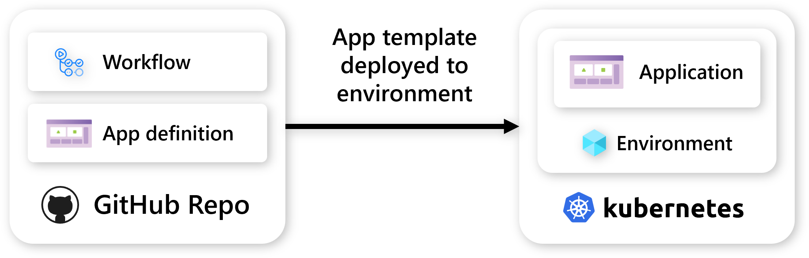

## GitHub Actions

It's easy to get Project Radius added to your GitHub Actions deployment pipelines. By leveraging the `rad` CLI, you can keep your checked-in app definitions in sync with your deployed instances of your app.

 

To learn more, visit the [GitHub Actions quickstart]().