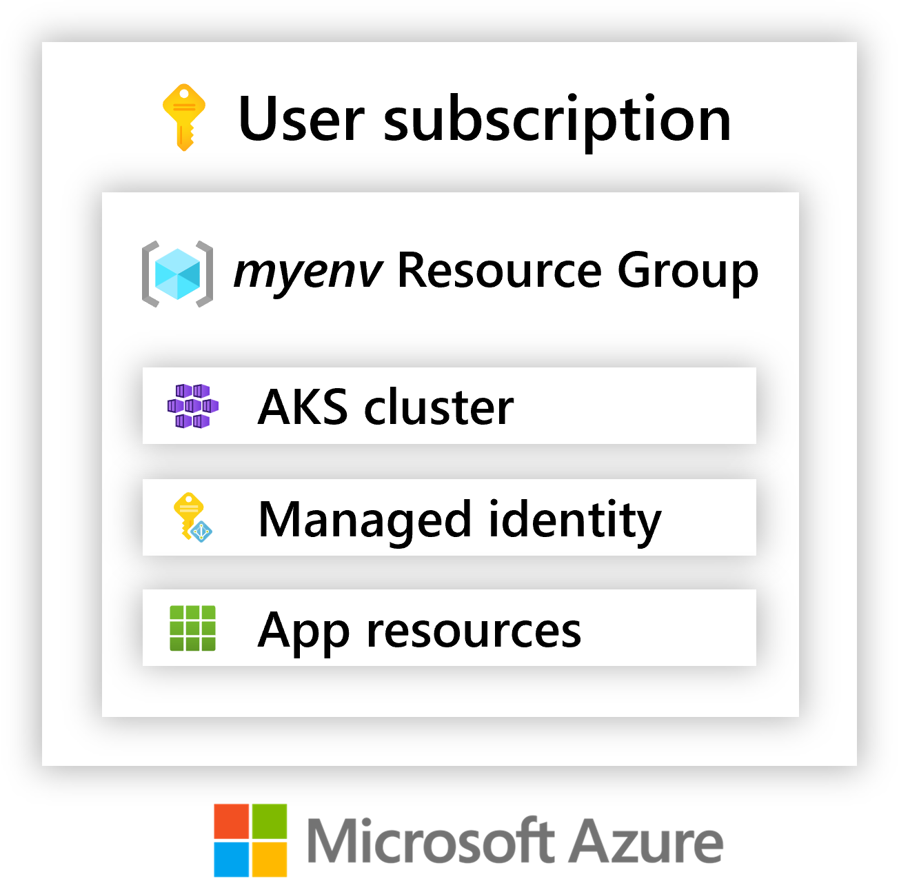

## Azure environments

An Azure environment consists of a Resource Group with Azure Kubernetes Service (AKS) cluster running the Radius control-plane. Applications deployed to Azure enviornments will run [Containers]() on the AKS cluster, and deploy and Azure resources to the Resource Group.

{}
Azure environments today are temporary pending the release of the Radius Azure resource provider. Stay tuned for updates.
{}



### Resources

| Resource | Description |
|----------|-------------|
| Azure Kubernetes Service (AKS) cluster | Runtime into which containers and workloads are deployed. Also hosts the Radius control-plane. Note that an additional managed Resource Group, prefixed with `MC-`, is also deployed to host the AKS cluster resources.
| Managed Identities | Identities uses by the Radius control-plane to deploy the Azure resources in your application templates.
| [Your Application resources] | When applications are deployed, any additional resources are deployed into the resource group.

## Managing environments

These steps will walk through how to deploy, manage, and delete environments in Microsoft Azure.

### Pre-requisites

- [Azure subscription](https://signup.azure.com)
- [az CLI](https://docs.microsoft.com/en-us/cli/azure/install-azure-cli). Ensure you are logged into Azure using `az login`.
- [rad CLI]()
- (optional) [create a an Azure Container Registry](https://docs.microsoft.com/en-us/azure/container-registry/container-registry-get-started-azure-cli) to use as a private container registry

### Deploy an environment

{}
While Radius environments are optimized for cost, any costs incurred by the deployment and use of a Radius environment in an Azure subscription are the responsibility of the user. Azure environments currently include a single node AKS cluster, an Azure CosmosDB account, and an App Service which all incur cost if deployed for extended periods.
{}

1. Deploy a Radius environment interactively:
   
   ```bash
   rad env init azure -i
   ```

   Follow the prompts, specifying the resource group you wish to create and selecting which region to deploy into.

   This step may take up to 10 minutes to deploy.

   {}
   To use a private container registry, you can specify the registry name as part of the `rad env init azure` command. The registry must be part of the same subscription as the environment being created.

   ```bash
   rad env init azure -i --container-registry myregistry
   ```

   {}

1. Verify deployment

   To verify the environment deployment succeeded, navigate to your subscription at https://portal.azure.com. You should see a new Resource Group with the name you entered during the previous step. It will contain the resources listed above.

### Connect to an existing environment

If you wish to attach to an existing environment instead of deploying a new one, simply specify the name, subscription, and resource group of an existing Radius environment when using the above steps for `rad env init azure -i`. The rad CLI will append the config for the existing environment to your local config file.

### Delete an environment

Use the rad CLI to [delete an environment]():

```bash
rad env delete -e azure --yes
```

## Troubleshooting

### Manually cleanup old/incomplete deployments

If your environment initialization does not complete or `rad env delete` does not work, follow these steps:

1. Delete the Azure resource group that contains the AKS cluster and managed identities
1. Open `~/.rad/config.yaml` and remove the YAML entry for the environment and the entry for the default environment, if set

## Related links

- [Radius tutorials]()
- [rad CLI reference]()
