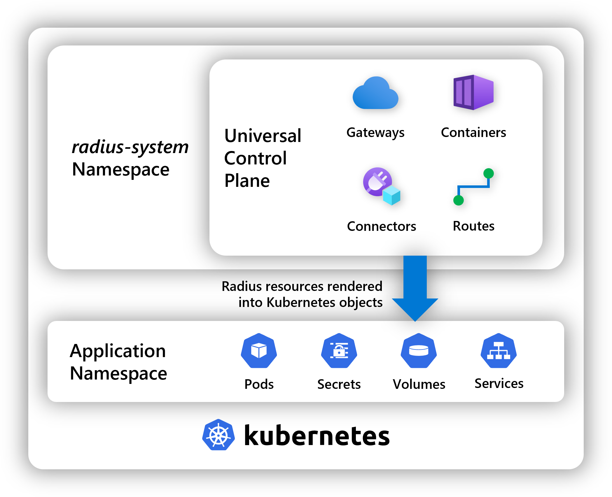

When deploying Radius resources to environments running on Kubernetes, the [control plane]() will render these resources into Kubernetes objects. This page describes these mappings and naming conventions.

## Resource mapping

The following resources map to Kubernetes resources. All other resources do not have a mapping and instead are tracked in the control plane.

| Radius resource                  | Kubernetes object | Rendered name |
|----------------------------------|-------------------|---------------|
| [`Applications.Core/containers`]() | `apps/Deployment@v1` | `<application-name>-<resource-name>` |
| [`Applications.Core/httpRoutes`]()   | `core/Service@v1` | `<application-name>-<resource-name>` |
| [`Applications.Core/gateways`]()     | `projectcontour.io/HTTPProxy@v1` | `<application-name>-<resource-name>` |
| [`Applications.Connector/daprPubSubBrokers`]() | `dapr.io/Component@v1alpha1` | `<application-name>-<resource-name>` - App scoped `<resource-name>` - Env scoped |
| [`Applications.Connector/daprSecretStores`]() | `dapr.io/Component@v1alpha1` | `<application-name>-<resource-name>` - App scoped `<resource-name>` - Env scoped |
| [`Applications.Connector/daprStateStores`]() | `dapr.io/Component@v1alpha1` | `<application-name>-<resource-name>` - App scoped `<resource-name>` - Env scoped |
