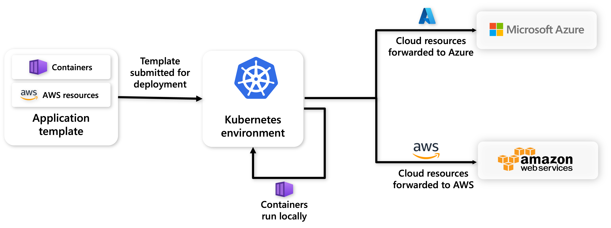

Radius cloud providers allow you to deploy and connect to cloud resources across various cloud platforms. For example, you can use the Radius Azure provider to run your application's services in your Kubernetes cluster, while deploying Azure resources to a specified Azure subscription and resource group.



## Supported cloud providers

| Provider | Description |
|----------|-------------|
| [Microsoft Azure](#azure-provider) | Deploy and connect to Azure resources |
| [Amazon Web Services](#aws-provider) | Deploy and connect to AWS resources |

## Configure a cloud provider

When initializing a new Radius environment you can optionally configure a cloud provider for your environment



{}

### Azure Provider

The Azure provider allows you to deploy and connect to Azure resources from a self-hosted Radius environment. 

#### Prerequisites

- [Azure subscription](https://azure.com)
- [az CLI](https://aka.ms/azcli)

#### Add a cloud provider when initializing an environment

1. Initialize a new [environment]() with `rad init`
1. Select the kubernetes cluster to install Radius. Enter an environment name and namespace to deploy the apps into. Note that this namespace is used for application deployments.
1. Select "yes" to add a cloud provider and select Azure as the cloud provider
1. Specify your Azure subscription and resource group
1. Create an [Azure service principal](https://docs.microsoft.com/cli/azure/ad/sp?view=azure-cli-latest#az-ad-sp-create-for-rbac) with the [proper permissions](https://aka.ms/azadsp-more). Enter the appID, password and the tenant of the service principal
1. Deploy your app and any included Azure resources with `rad deploy`

#### Add a cloud provider to an existing environment

1. Create an [Azure service principal](https://docs.microsoft.com/cli/azure/ad/sp?view=azure-cli-latest#az-ad-sp-create-for-rbac) with the [proper permissions](https://aka.ms/azadsp-more). 

   ```bash
   az ad sp create-for-rbac --role Owner --scope --scope /subscriptions/<subscriptionid>/resourceGroups/<resourcegroupname> 
   ```
   Replace it with your subscription id and resource group name
   
1. Register the service principal in your control plane
   ```bash
   rad credential register azure --client-id <appId> --client-secret <password> --tenant-id <tenant id>
   ```
   Replace it with your service principal appId, password and tenant id

1. Update your environment with your Azure subscription and resource group
   ```bash
   rad env update <myenv> --azure-subscription-id <subscriptionid> --azure-resource-group <resourcegroupname> 
   ```
1. Deploy your app and any included Azure resources with `rad deploy`

#### Add a cloud provider to an AKS cluster using AAD pod identity

[Azure Active Directory (Azure AD) pod-managed identities](https://docs.microsoft.com/azure/aks/use-azure-ad-pod-identity) use Kubernetes primitives to associate managed identities for Azure resources and identities in Azure AD with pods. Administrators create identities and bindings as Kubernetes primitives that allow pods to access Azure resources that rely on Azure AD as an identity provider.

1. Enable the preview az aks addon:
   ```bash
   az extension add --name aks-preview && az extension update --name aks-preview
   ```
1. Deploy an AKS cluster with [pod identity](https://docs.microsoft.com/azure/aks/use-azure-ad-pod-identity) enabled, or enable it on your existing cluster
   ```bash
   az aks create -g MY_RESOURCE_GROUP -n ${MY_CLUSTER} --enable-pod-identity --enable-pod-identity-with-kubenet
   ```
   or
   ```bash
   az aks update -g MY_RESOURCE_GROUP -n ${MY_CLUSTER} --enable-pod-identity --enable-pod-identity-with-kubenet
   ```
1. Deploy a User Assigned Managed identity, and give it a Contributor (or custom) role assignment to your desired Azure resource group
   ```bash
   az identity create --resource-group MY_RESOURCE_GROUP --name IDENTITY_NAME
   export IDENTITY_CLIENT_ID="$(az identity show -g MY_RESOURCE_GROUP -n IDENTITY_NAME --query clientId -otsv)"
   export IDENTITY_RESOURCE_ID="$(az identity show -g MY_RESOURCE_GROUP -n IDENTITY_NAME --query id -otsv)"
   ```
   ```bash
   export GROUP_RESOURCE_ID=$(az group show -n MY_RESOURCE_GROUP -o tsv --query "id")
   az role assignment create --role "Contributor" --assignee ${IDENTITY_CLIENT_ID} --scope ${GROUP_RESOURCE_ID}
   ```
1. Create a pod identity named "radius" with the User Assigned Managed identity:
   ```bash
   az aks pod-identity add --resource-group ${MY_RESOURCE_GROUP} --cluster-name ${MY_CLUSTER} --namespace radius-system  --name radius --identity-resource-id ${IDENTITY_RESOURCE_ID}
   ```
1. Install the [Radius Helm chart]() with the azure provider values set:
   ```bash
   helm upgrade radius radius/radius --install --create-namespace --namespace radius-system --version  --wait --timeout 15m0s --set rp.provider.azure.podidentity=radius --set rp.provider.azure.subscriptionId=${MY_SUBSCIRPTION_ID} --set rp.provider.azure.resourceGroup=${MY_RESOURCE_GROUP}
   ```
1. Create a new environment:
   ```bash
   rad init
   ```
1. Manually add the `subscriptionId` and `resourcegroup` Azure cloud provider values to your local config:
   ```yaml
   workspaces:
     default: myenv
     items:
       myenv:
         connection:
           context: MY_CONTEXT
           kind: kubernetes
         environment: /planes/radius/local/resourcegroups/myenv/providers/applications.core/environments/myenv
         scope: /planes/radius/local/resourceGroups/myenv
         providerConfig:
           azure:
             subscriptionid: "MY_SUBSCIRPTION_ID"
             resourcegroup: "MY_RESOURCE_GROUP"
   ```
{}

{}

### AWS Provider

The AWS provider allows you to deploy and connect to AWS resources from a Radius environment on an EKS cluster. 

#### Prerequisites
- [AWS account](https://aws.amazon.com/premiumsupport/knowledge-center/create-and-activate-aws-account) and an [IAM user](https://docs.aws.amazon.com/IAM/latest/UserGuide/getting-started_create-admin-group.html)
- [AWS CLI](https://docs.aws.amazon.com/cli/latest/userguide/getting-started-install.html)

#### Add a cloud provider when initializing an environment

1. Initialize a new [environment]() with `rad init`
1. Select the kubernetes cluster to install Radius. Enter an environment name and namespace to deploy the apps into. Note that this namespace is used for application deployments.
1. Select "yes" to add a cloud provider and select AWS as the cloud provider
1. Enter a valid AWS region
1. [Create an IAM AWS access key](https://docs.aws.amazon.com/IAM/latest/UserGuide/id_credentials_access-keys.html) and enter the Access Key ID and the AWS Secret Access Key. If you have already created an Access Key pair, you can use that instead.
1. Deploy your app and any included AWS resources with `rad deploy`

{}

