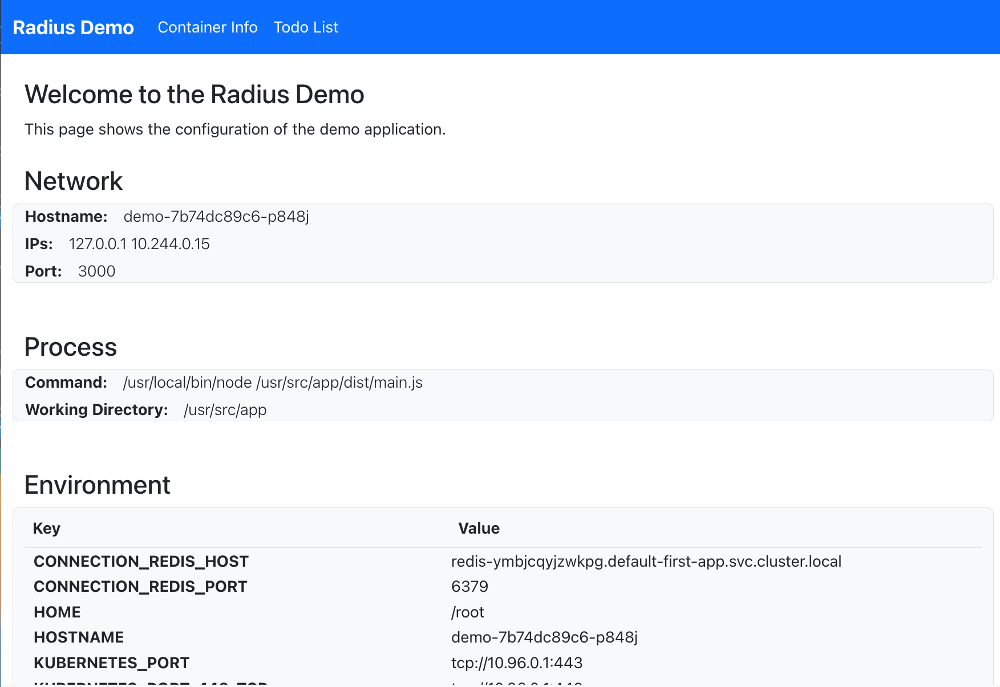
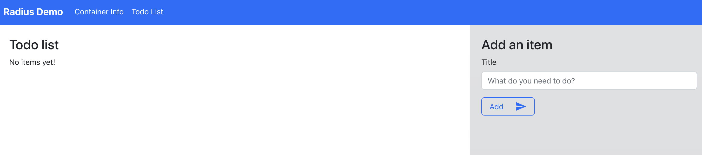

This tutorial will teach you the following about Radius:

* How to use update a Helm chart to include its resources in a Radius application
* How to use features like Recipes and Connections within Kubernetes YAML or Helm


## Prerequisites

- [rad CLI]()
- [Helm](https://helm.sh/docs/intro/install/)
- [Setup a supported Kubernetes cluster]()

## Step 1. Clone and open the sample code



{}

It's easy and free to get up and running with a Radius Codespace in GitHub. Spin up a Radius environment in seconds with the following link:

[](https://codespaces.new/radius-project/samples)

Once launched you should already have the application cloned locally. Use the terminal to navigate to the `./demo/` directory:

```bash
cd ./samples/demo
```
{}

{}
Use the terminal to clone the `samples` repository locally and navigate to the `./samples/demo` directory:

```bash
git clone https://github.com/radius-project/samples.git
cd ./samples/samples/demo
```
{}




## Step 2. Initialize Radius

Initialize Radius. For this example, answer **NO** when asked whether to set up an application: 

> Select 'No' when prompted to create an application.

```bash
rad init
```

## Step 3. Understand and deploy the application

1. Navigate to the `./Chart` folder and browse its contents. This contains a Helm chart for the application that you will modify.

    Here are the contents of `./demo/Chart/templates/app.yaml`. This file is part of the Helm chart, and describes the container used for this tutorial:

    ```yaml
    apiVersion: apps/v1
    kind: Deployment
    metadata:
      name: webapp
      namespace: {{ .Release.Namespace }}
    spec:
      selector:
        matchLabels:
          app: webapp
      template:
        metadata:
          labels:
            app: webapp
        spec:
          containers:
          - name: webapp
            image: {{ .Values.image.repository }}:{{ .Values.image.tag }}
            env: 
            - name: CONNECTION_REDIS_URL
              valueFrom:
                secretKeyRef:
                  name: redis-secret
                  key: url
            ports:
            - containerPort: 3000
    ```

    The container that you will be working with is a ToDo application that uses Redis as a database. 

    - The container is configured to listen on port 3000.
    - The container will use the environment variable `CONNECTION_REDIS_URL` to connect to Redis.
    - This `CONNECTION_REDIS_URL` environment variable is populated by a Kubernetes Secret.

    You can deploy this application for the first time by following these steps:

    - Create the Kubernetes namespace `demo`
    - Create the Kubernetes Secret `redis-secret` containing the Redis URL.
    - Install the Helm chart.

     For now you're not going to actually deploy Redis and the URL in this step is fake. You will deploy Redis using a Recipe later in the tutorial that will replace the fake URL contained within `redis-secret` with an actual container and URL.

1. Complete these steps by running the following commands:

    ```bash
    kubectl create namespace demo
    kubectl create secret generic --namespace demo --from-literal=url=redis://fake-server redis-secret
    helm upgrade demo ./Chart -n demo --install
    ```

    The output should look similar to the following:

    ```
    > kubectl create namespace demo
    namespace/demo created

    > kubectl create secret generic --namespace demo --from-literal=url=redis://fake-server redis-secret
    secret/redis-secret created

    > helm upgrade demo ./Chart -n demo --install
    Release "demo" does not exist. Installing it now.
    NAME: demo
    LAST DEPLOYED: Wed Sep 13 01:05:19 2023
    NAMESPACE: demo
    STATUS: deployed
    REVISION: 1
    TEST SUITE: None
    ```

     If you see an error message like **Error: path "./Chart" not found** then you are in the wrong directory. Make sure your terminal is in the `./demo` directory of the `samples` repository.

1. Run the following command to check if everything is running:

    ```bash
    kubectl get all -n demo
    ```

    The output should look similar to the following:

    ```
    > kubectl get all -n demo
    NAME                          READY   STATUS    RESTARTS   AGE
    pod/webapp-79d5dfb99-vhj9g    1/1     Running   0          2m48s

    NAME                      READY   UP-TO-DATE   AVAILABLE   AGE
    deployment.apps/webapp    1/1     1            1           2m49s

    NAME                                DESIRED   CURRENT   READY   AGE
    replicaset.apps/webapp-79d5dfb99    1         1         1       2m49s
    ```

    > The generated names and ages of the objects will be different in your output. Make sure you see the status of `Running` for the `pod/webapp-...` entry. If the status is not `Running`, try repeating the `kubectl get all -n demo` after waiting.

    At this point you've deployed the application but you have not actually used Radius yet. You will start doing that in the next step, as well as set up and use Redis.

The steps so far are similar to how many applications are managed today:

- Dependencies like Redis are provisioned manually and separately from application deployment.
- Connection information like passwords and addresses is manually stored in secret stores.
- Applications access the connection information from those secret stores when they are deployed.

Over the next few steps you will update this application to use Radius so that:

- ✅ Dependencies like Redis are provisioned on-demand when they are needed.
- ✅ Connection information is managed automatically, secret stores are an implementation detail.
- ✅ Applications have a documented relationship with the dependencies they connect to.

From here you will go through a series of steps to incrementally add more Radius features to the application.

## Step 4. Add Radius

1. Make sure the `app.yaml` file from `./demo/Chart/templates/app.yaml` is open in your editor. You will make some edits to this file to enable Radius.

    Add the `annotations` property to `metadata`, and then add the `radapp.io/enabled: 'true'` annotation. The `'true'` must be surrounded in quotes.

    The example below shows the updated `metadata` section after making the changes.

    ```yaml
    apiVersion: apps/v1
    kind: Deployment
    metadata:
      name: webapp
      namespace: {{ .Release.Namespace }}
      # Add the following two lines
      annotations:
        radapp.io/enabled: 'true'
    spec:
    ...
    ```

    Adding the `radapp.io/enabled: 'true'` annotation enables Radius for the deployment.

1. Save the file after you have made the edits and deploy the application again using Helm. Since the namespace and secret have already been created, we only need to run the `helm` command.

    ```bash
    helm upgrade demo ./Chart -n demo --install
    ```

    The output should look like:

    ```
    > helm upgrade demo ./Chart -n demo --install
    Release "demo" has been upgraded. Happy Helming!
    NAME: demo
    LAST DEPLOYED: Wed Sep 13 01:31:58 2023
    NAMESPACE: demo
    STATUS: deployed
    REVISION: 2
    TEST SUITE: None
    ```

    You should confirm that your output contains `REVISION: 2`, that means that the changes were applied.

1. Run the following command to confirm that everything is running:

    ```bash
    kubectl get all -n demo
    ```

    The output should look similar to the following:

    ```
    > kubectl get all -n demo
    NAME                          READY   STATUS    RESTARTS   AGE
    pod/webapp-79d5dfb99-mv6q9    1/1     Running   0         10m

    NAME                      READY   UP-TO-DATE   AVAILABLE   AGE
    deployment.apps/webapp    1/1     1            1           10m

    NAME                                DESIRED   CURRENT   READY   AGE
    replicaset.apps/webapp-79d5dfb99    1         1         1       10m
    ```

    Notice that the `AGE` of `pod/webapp-...` reflects the time of your **first** deployment. Enabling Radius for an application does not change any of its behaviors, so Kubernetes did not need to restart the container.

1. Now that Radius has been enabled, run this command to display the state of the Radius application:

    ```bash
    rad app graph -a demo -g default-demo
    ```

    The output should look like this:

    ```
    > rad app graph -a demo -g default-demo
    Displaying application: demo

    Name: webapp (Applications.Core/containers)
    Connections: (none)
    Resources:
      webapp (kubernetes: apps/Deployment)
    ```

    This means that Radius has found the Kubernetes `Deployment` running your container and cataloged it as part of the application. 

    Radius will use the Kubernetes namespace as the application name by default. 

## Step 5. Add Recipe

This step will add a database (Redis Cache) to the application.

You can create a Redis Cache using [Recipes]() provided by Radius. The Radius community provides [Recipes](https://github.com/radius-project/recipes) for running commonly used application dependencies, including Redis.

In this step you will:

- Add Redis to the application using a Recipe.
- Update the Kubernetes secret with the connection information from Redis.

1. First, check recipes installed in your environment by running:

    ```bash
    rad recipe list
    ```

    You will see output like this:

    ```
    NAME      TYPE                                    TEMPLATE KIND  TEMPLATE VERSION  TEMPLATE
    default   Applications.Datastores/sqlDatabases    bicep                            radius.ghcr.io/recipes/local-dev/sqldatabases:latest
    default   Applications.Messaging/rabbitMQQueues   bicep                            radius.ghcr.io/recipes/local-dev/rabbitmqqueues:latest
    default   Applications.Dapr/pubSubBrokers         bicep                            radius.ghcr.io/recipes/local-dev/pubsubbrokers:latest
    default   Applications.Dapr/secretStores          bicep                            radius.ghcr.io/recipes/local-dev/secretstores:latest
    default   Applications.Dapr/stateStores           bicep                            radius.ghcr.io/recipes/local-dev/statestores:latest
    default   Applications.Datastores/mongoDatabases  bicep                            radius.ghcr.io/recipes/local-dev/mongodatabases:latest
    default   Applications.Datastores/redisCaches     bicep                            radius.ghcr.io/recipes/local-dev/rediscaches:latest
    ```

    The recipe for `Applications.Datastores/redisCaches` is what you will use in this example.

    
    Radius includes Recipes for local development when you use `rad init`. These [**local-dev**](https://github.com/radius-project/recipes/tree/main/local-dev) Recipes run popular OSS technologies as containerized infrastructure without requiring a cloud account.

    In a production environment you can substitute recipes that will create cloud or on-premises dependencies instead.
    

1. Make sure the `app.yaml` file from `./demo/Chart/templates/app.yaml` is open in your editor. At the bottom of the file add the following text, including the `---`:

    ```yaml
    ---
    apiVersion: radapp.io/v1alpha3
    kind: Recipe
    metadata:
      name: db
      namespace: {{ .Release.Namespace }}
    spec:
      type: Applications.Datastores/redisCaches
      secretName: redis-secret
    ```

    Defining a `Recipe` object in Kubernetes will use a Radius Recipe to create dependencies for your application:

    - The `.spec.type` field defines the type of resource to create. `Applications.Datastores/redisCaches` is the type for a Redis Cache.
    - The `.spec.secretName` field tells Radius where to store connection information. This is optional, and should be used to interoperate with other Kubernetes technologies that read from secrets. This tutorial example uses the secret to populate an environment variable.

1. Save the file after you have made the edits and deploy the application again using Helm. Since the namespace and secret have already been created, you only need to run the `helm` command.

    ```bash
    helm upgrade demo ./Chart -n demo --install
    ```

    The output should look like:

    ```
    > helm upgrade demo ./Chart -n demo --install
    Release "demo" has been upgraded. Happy Helming!
    NAME: demo
    LAST DEPLOYED: Wed Sep 13 01:44:04 2023
    NAMESPACE: demo
    STATUS: deployed
    REVISION: 3
    TEST SUITE: None
    ```

    This time you should see `REVISION: 3`.

1. Now that you are using a Recipe, you should see more resources running in Kubernetes. Run the following command:

    ```bash
    kubectl get all -n demo
    ```

    The output should look similar to the following:

    ```
    > kubectl get all -n demo

    pod/redis-r5tcrra3d7uh6-7bcd8b8d8d-jmgn4     2/2     Running   0          51s
    pod/webapp-79d5dfb99-f6xgj                   1/1     Running   0          52s

    NAME                          TYPE        CLUSTER-IP     EXTERNAL-IP   PORT(S)    AGE
    service/redis-r5tcrra3d7uh6   ClusterIP   10.43.104.63   <none>        6379/TCP   51s

    NAME                                  READY   UP-TO-DATE   AVAILABLE   AGE
    deployment.apps/redis-r5tcrra3d7uh6   1/1     1            1           51s
    deployment.apps/webapp                1/1     1            1           52s

    NAME                                             DESIRED   CURRENT   READY   AGE
    replicaset.apps/redis-r5tcrra3d7uh6-7bcd8b8d8d   1         1         1       51s
    replicaset.apps/webapp-79d5dfb99                 1         1         1       52s

    NAME                  TYPE                                  SECRET         STATUS
    recipe.radapp.io/db   Applications.Datastores/redisCaches   redis-secret   Ready
    ```

    Look at the status of the `recipe.radapp.io/db` resource. If the status is not `Ready`, then try running the command again after a delay. The status should show as `Ready` when the Recipe has fully-deployed. You can also see additional resources starting with `redis-`. These were created by the Recipe.

     If you do not see the additional resources starting with `redis-` then it's likely they are in a different Kubernetes namespace. Run `kubectl get all -A` to see everything.

1. Now that you have added a Recipe, run this command to display the state of the Radius application:

    ```bash
    rad app graph -a demo -g default-demo
    ```

    The output should look like this:

    ```
    > rad app graph -a demo -g default-demo
    Displaying application: demo

    Name: webapp (Applications.Core/containers)
    Connections: (none)
    Resources:
      webapp (kubernetes: apps/Deployment)

    Name: db (Applications.Datastores/redisCaches)
    Connections: (none)
    Resources:
      redis-r5tcrra3d7uh6 (kubernetes: apps/Deployment)
      redis-r5tcrra3d7uh6 (kubernetes: core/Service)
    ```

    `rad app graph` shows the **Application Graph** of the application. This includes:

    - Entries for each major resource: `webapp` is an `Applications.Core/containers` and `db` is an `Applications.Datastores/redisCaches`.
    - Connections between resources: (none yet, you will add this next).
    - Resources that were created: see the Kubernetes `Deployment` listed for `webapp` and the Kubernetes `Deployment` and `Service` listed for `db`.

    The Redis Cache created by the recipe is visible as part of the application. You can also see the `Resources` created in Kubernetes that make up the Redis Cache. In a previous step you saw these listed by `kubectl`. Since Radius deployed the Recipe, it knows that these resources *logically* are part of the Redis Cache in the application.

1. You can also see the contents of `redis-secret` as created by Radius. Run the following command:

    ```bash
    kubectl get secret -n demo redis-secret -o yaml
    ```

    The output should look like the following:

    ```
    >kubectl get secret -n demo redis-secret -o yaml
    apiVersion: v1
    data:
      connectionString: cmVkaXMtcjV0Y3JyYTNkN3VoNi5kZW1vLnN2Yy5jbHVzdGVyLmxvY2FsOjYzNzksYWJvcnRDb25uZWN0PUZhbHNl
      host: cmVkaXMtcjV0Y3JyYTNkN3VoNi5kZW1vLnN2Yy5jbHVzdGVyLmxvY2Fs
      password: ""
      port: NjM3OQ==
      tls: ZmFsc2U=
      url: cmVkaXM6Ly9yZWRpcy1yNXRjcnJhM2Q3dWg2LmRlbW8uc3ZjLmNsdXN0ZXIubG9jYWw6NjM3OS8wPw==
      username: ""
    kind: Secret
    metadata:
      creationTimestamp: "2023-09-13T01:49:36Z"
      name: redis-secret
      namespace: demo
      ownerReferences:
      - apiVersion: radapp.io/v1alpha3
        blockOwnerDeletion: true
        controller: true
        kind: Recipe
        name: db
        uid: d40567a1-cd52-4984-8321-6cb8bea5f798
      resourceVersion: "3672"
      uid: b1613fb0-09e6-4f76-8685-02f458e173b9
    type: Opaque
    ```

    The actual values like `connectionString` are Base64 encoded in this display. The `url` value in this secret is being used by the container to connect to the Redis Cache. For each type of Recipe, Radius stores the most-commonly used connection information for the convenience of application developers.

## Step 6. Add Connection

At this point you have added Radius to your existing container and used a Recipe to create a Redis Cache. In this step, you will use Radius Connections to inject settings into the container instead of explicitly managing a secret.

Make sure the `app.yaml` file from `./demo/Chart/templates/app.yaml` is open in your editor.

1. First, add another annotation. This time add the `radapp.io/connection-redis: 'db'` annotation, to `.metadata.annotations`. Order does not matter but indentation does.

    Here's the updated content of `metadata`:

    ```yaml
    apiVersion: apps/v1
    kind: Deployment
    metadata:
      name: webapp
      namespace: {{ .Release.Namespace }}
      annotations:
        radapp.io/enabled: 'true'
        radapp.io/connection-redis: 'db'
    spec:
    ...
    ```

    The `radapp.io/connection-` annotation defines a connection from the container to some other dependency. Each connection has:

    - A name: `redis` is the connection name this case.
    - A source: `db` is the name of the Recipe you created earlier.

    Connections are named because you can define many of them. The connection name is used to generate environment variables that are unique to the connection. 

    Since you're using a connection called `redis`, Radius will automatically define the `CONNECTION_REDIS_URL` environment variable. The prefix of `CONNECTION_REDIS_` will be combined with each of the settings that you could see in the `redis-secret` secret in the previous step.

1. You can remove the manual definition of `CONNECTION_REDIS_URL` from `app.yaml` since Radius will provide it automatically. Find the `env` property and delete all of its contents. You can also remove `.spec.secretName` from the `Recipe`.

    The final contents of `app.yaml` should look like:

    ```yaml
    apiVersion: apps/v1
    kind: Deployment
    metadata:
      name: webapp
      namespace: {{ .Release.Namespace }}
      annotations:
        radapp.io/enabled: 'true'
        radapp.io/connection-redis: 'db'
    spec:
      selector:
        matchLabels:
          app: webapp
      template:
        metadata:
          labels:
            app: webapp
        spec:
          containers:
          - name: webapp
            image: {{ .Values.image.repository }}:{{ .Values.image.tag }}
            ports:
            - containerPort: 3000
    ---
    apiVersion: radapp.io/v1alpha3
    kind: Recipe
    metadata:
      name: db
      namespace: {{ .Release.Namespace }}
    spec:
      type: Applications.Datastores/redisCaches
    ```

1. Save the file after you have made the edits and deploy the application again using Helm.

    ```bash
    helm upgrade demo ./Chart -n demo --install
    ```

    The output should look like:

    ```
    > helm upgrade demo ./Chart -n demo --install
    Release "demo" has been upgraded. Happy Helming!
    NAME: demo
    LAST DEPLOYED: Wed Sep 13 02:09:41 2023
    NAMESPACE: demo
    STATUS: deployed
    REVISION: 4
    TEST SUITE: None
    ```

    This time you should see `REVISION: 4`.

    Check the status in Kubernetes again by running:

    ```bash
    kubectl get all -n demo
    ```

    The output should look like:

    ```
    > kubectl get all -n demo
    NAME                                       READY   STATUS    RESTARTS   AGE
    pod/redis-r5tcrra3d7uh6-7bcd8b8d8d-jmgn4   2/2     Running   0          20m
    pod/webapp-76db7964d8-plc2s                1/1     Running   0          37s

    NAME                          TYPE        CLUSTER-IP     EXTERNAL-IP   PORT(S)    AGE
    service/redis-r5tcrra3d7uh6   ClusterIP   10.43.104.63   <none>        6379/TCP   20m

    NAME                                  READY   UP-TO-DATE   AVAILABLE   AGE
    deployment.apps/redis-r5tcrra3d7uh6   1/1     1            1           20m
    deployment.apps/webapp                1/1     1            1           20m

    NAME                                             DESIRED   CURRENT   READY   AGE
    replicaset.apps/redis-r5tcrra3d7uh6-7bcd8b8d8d   1         1         1       20m
    replicaset.apps/webapp-79d5dfb99                 0         0         0       20m
    replicaset.apps/webapp-76db7964d8                1         1         1       37s
    replicaset.apps/webapp-687dcf5cdf                0         0         0       38s

    NAME                  TYPE                                  SECRET   STATUS
    recipe.radapp.io/db   Applications.Datastores/redisCaches            Ready
    ```

    Depending on the timing you may see pods in the `Terminating` state. This is normal as old replicas take some time to shut down.

1. Check the Radius status again. Now Radius is aware of the connection from `webapp->db`:

    ```bash
    rad app graph -a demo -g default-demo
    ```

    The output should look like the example below:

    ```
    > rad app graph -a demo -g default-demo
    Displaying application: demo

    Name: webapp (Applications.Core/containers)
    Connections:
      webapp -> db (Applications.Datastores/redisCaches)
    Resources:
      webapp (kubernetes: apps/Deployment)

    Name: db (Applications.Datastores/redisCaches)
    Connections:
      webapp (Applications.Core/containers) -> db
    Resources:
      redis-r5tcrra3d7uh6 (kubernetes: apps/Deployment)
      redis-r5tcrra3d7uh6 (kubernetes: core/Service)
    ```

## Step 7. Try it out

In this step you can access the application and explore its features. Since the container is running inside Kubernetes, you need to run a port-forward to use it locally.

1. Run the following command to start the port-forward:

    ```bash
    kubectl port-forward -n demo deployment/webapp 3000
    ```

    If you are inside Codespaces this will open a new browser tab that you can use to access the webapp. 

    If you are not using Codespaces then open your browser and navigate to `http://localhost:3000`

    
    <br /><br />

    Congrats! You're running your first Radius app.

    You can use the homepage to view information about the container and its settings.

1. Navigate to the ToDo List tab and test out the application. Using the ToDo page will update the saved state in Redis.

    
    <br /><br />

    When you're ready to move on to the next step, use `CTRL+C` to exit the command.

## Cleanup and next steps

To delete your app, run the following command:

> This command also cleans up all the resources created by the Radius Recipe you deployed earlier.

```bash
helm uninstall demo -n demo
```

In summary, this tutorial walked through a hands-on example to show you how-to:

- Enable Radius for a Helm or Kubernetes-based application to catalog your assets.
- Use Recipes to create dependencies either for development or production use.
- Use Connections to automate the management of connection information.

<br>

