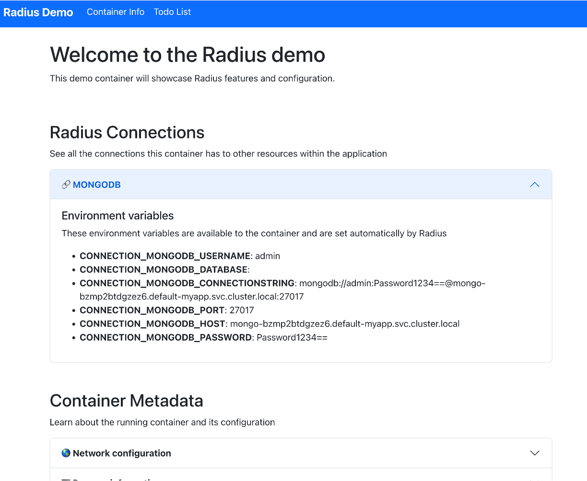

This tutorial will walk you through the basics of creating a new Radius application. You will learn how to:

1. Define and deploy a Radius application
1. Add a container to your application and customize that container
1. Add a Mongo database to your application and connect it to your container
1. Add a second container and connect it to your first container
1. Securely expose your application to the internet through a gateway

By the end of the tutorial, you will have created and deployed a new Radius application.


## Prerequisites

- [Kubernetes cluster]()
- [rad CLI]()

## Step 1: Initialize a Radius environment

Radius environments are where applications are deployed. Environments determine how an application runs on a particular platform (like AWS or Azure). If you don't have one already, initialize a new environment in your favorite Kubernetes cluster with [`rad init`]():

```bash
rad init
```

## Step 2: Create an application

A Radius application is an Infrastructure as Code (IaC) file wherein you explicitly define all the resources (containers, gateways, cloud services, etc) that make up your application, including how those resources are connected to each other.  Given this explicit and comprehensive application definition, Radius application files make it simple to consistently deploy and manage your application as a single entity.

1. Begin by creating a new file named `app.bicep`:

   ```bash
   touch app.bicep
   ```

1. Open `app.bicep` and add the following code to define a new application named `myapp`:

   {}

1. Deploy `app.bicep` with [`rad deploy`]():

   ```bash
   rad deploy app.bicep
   ```

   You should see your application resource deployed:

   ```
   Building .\app.bicep...
   Deploying template '.\app.bicep' for application 'myapp' and environment 'default' from workspace 'default'...

   Deployment In Progress...


   Deployment Complete

   Resources:
       myapp           Applications.Core/applications
   ```

1. View the full application definition by running [`rad app show -o json`]():

   ```bash
   rad app show myapp -o json
   ```

   You will see the full application definition in JSON format:
   
   ```
   {
     "id": "/planes/radius/local/resourcegroups/default/providers/Applications.Core/applications/myapp",
     "location": "global",
     "name": "myapp",
     "properties": {
       "environment": "/planes/radius/local/resourceGroups/default/providers/Applications.Core/environments/default",
       "provisioningState": "Succeeded",
       "status": {
         "compute": {
           "kind": "kubernetes",
           "namespace": "default-myapp"
         }
       }
     },
     "systemData": {},
     "tags": {},
     "type": "Applications.Core/applications"
   }
   ```
   
   There are a few important things to note about the application definition:

   1. The `id` property is the fully-qualified UCP resource ID of the application. This value is used to uniquely identify the application in the Radius system.
   1. The `location` property is the location of the application. For now, all applications are deployed to the `global` location.
   1. The application will be deployed to the 'default' environment, which is created when you run `rad init`.
   1. The `status` property contains `compute` information, which specifies where services in the application will be deployed. In this case, the services will be deployed into the `default-myapp` Kubernetes namespace (the same cluster where Radius is installed).

## Step 3: Create your frontend container

Now that your application is defined, you can add resources to it. The first resource we'll add is a container. Containers are the basic building block of Radius applications and are where your code runs.

1. Update your `app.bicep` file with a container named `frontend`. Also add an environment variable to customize your container:

   {}

1. Run `app.bicep` with [`rad run`](). This will deploy the container, automatically set up port forwarding, and forward the application log output:

   ```bash
   rad run app.bicep --application myapp
   ```

   ```
   Building .\app.bicep...
   Deploying template '.\app.bicep' for application 'myapp' and environment 'default' from workspace 'default'...
   
   Deployment In Progress...
   
   
   Deployment Complete
   
   Resources:
       myapp           Applications.Core/applications
       frontend        Applications.Core/containers
   
   Starting log stream...
   ```

1. Open [localhost:3000](http://localhost:3000) to interact with the frontend container you just deployed. You will see the container's connections and metadata. Expand the Environment Variables section to see the environment variables you set in the `app.bicep` file:

    

1. Press CTRL+C to terminate the port-forward and log stream.

## Step 4: Add a dependency and a connection

Next, you can add a dependency to your application. Dependencies are external services or infrastructure your container will interact with, such as a database, cache, message queue, etc.

1. Add a Mongo database to your `app.bicep` file:

   {}

1. Add a connection from your container to the Mongo database:

   {}

1. Re-run your app with [`rad run`]():

    ```bash
    rad run app.bicep --application myapp
    ```

    ```
    Building .\app.bicep...
    Deploying template '.\app.bicep' for application 'myapp' and environment 'default' from workspace 'default'...
    
    Deployment In Progress...
    
    
    Deployment Complete
    
    Resources:
        myapp           Applications.Core/applications
        frontend        Applications.Core/containers
        mongodb         Applications.Datastores/mongoDatabases
    
    Starting log stream...
    ```

1. Open [localhost:3000](http://localhost:3000) to interact with the frontend container. You should see the container's connections and metadata, this time with a connection to the Mongo database and new environment variables set:

    

1. Press CTRL+C to terminate the port-forward and log stream.

## Step 5: Add a backend container

In addition to dependencies, you can add more containers to make your application code more modular.  Containers can be configured to interact with each other as needed.

1. Add a second container named `backend` to your `app.bicep` file, specifying the image and port to open to other containers:

   {}

1. Add a new connection from your `frontend` container to the `backend` container:

   {}

1. Re-run your app with [`rad run`]():

    ```bash
    rad run app.bicep --application myapp
    ```

    ```
    Building .\app.bicep...
    Deploying template '.\app.bicep' for application 'myapp' and environment 'default' from workspace 'default'...
    
    Deployment In Progress...
    
    
    Deployment Complete
    
    Resources:
        myapp           Applications.Core/applications
        frontend        Applications.Core/containers
        backend         Applications.Core/containers
        mongodb         Applications.Datastores/mongoDatabases
    
    Starting log stream...
    ```

1. Open [localhost:3000](http://localhost:3000) to interact with the frontend container. You should see the container's connections and metadata, this time with a connection to the backend container and new environment variables set:

   

    Note the environment variables that are set with connection information for the backend container.

## Step 6: Add a gateway

Finally, you can add a gateway to your application. Gateways are used to expose your application to the internet. They can expose a single container or multiple containers.

1. Add a gateway to your `app.bicep` file:

   {}

1. Deploy your app with [`rad deploy`]():

    ```bash
    rad deploy app.bicep
    ```

    ```
    Building .\app.bicep...
    Deploying template '.\app.bicep' for application 'myapp' and environment 'default' from workspace 'default'...
    
    Deployment In Progress...
    
    
    Deployment Complete
    
    Resources:
        myapp           Applications.Core/applications
        frontend        Applications.Core/containers
        backend         Applications.Core/containers
        gateway         Applications.Core/gateways
        mongodb         Applications.Datastores/mongoDatabases
    
    Public Endpoints:
        gateway         Applications.Core/gateways http://localhost
    ```

1. Open the gateway URL in your browser. Unlike before, you are connecting to the gateway instead of directly to the container. You will see the same container connections and metadata as before.

1. Done! You've successfully created your first Radius application.

## Next steps

Now that you've created your first application, try out more [tutorials]() or jump into the [user guides]() to learn more about Radius.

