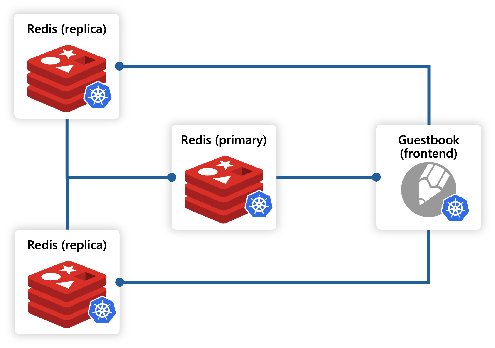
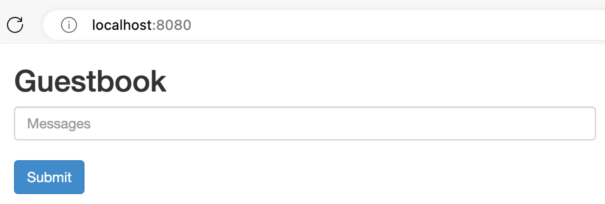

This tutorial will teach you about adding Radius to an existing application using the built-in Kubernetes integration functionality. You will learn how to:

1. Deploy an existing Kubernetes application
1. Run and test the application
1. Add Radius to the deployed application
1. Confirm that Radius was added and can detect the application

By the end of this tutorial, you will have deployed an existing Kubernetes application and then updated it to add Radius functionality without changing the application or its original Kubernetes configurations.

## Prerequisites

- [Kubernetes cluster]()
- [kubectl](https://kubernetes.io/docs/tasks/tools/install-kubectl/)
- [rad CLI]()

## Overview

As a part of this tutorial you will deploy an existing containerized Guestbook application originally authored by the Kubernetes community for use in their own tutorials. You will then add Radius to the deployed application. To incrementally add Radius to an existing application, you will leverage the built-in Kubernetes integration functionality by adding an annotation to the application's Kubernetes deployment manifest. This approach is particularly useful for adding Radius capabilities to applications that are already deployed.

The Guestbook application consists of a web front end along with primary and secondary Redis containers for storage, all deployed with Kubernetes. For more information about the application and access its source code, see the [Kubernetes tutorial](https://kubernetes.io/docs/tutorials/stateless-application/guestbook/) and their [examples repo](https://github.com/kubernetes/examples/tree/master/guestbook).



## Step 1: Set up your environment

1. Clone the Radius samples repo to your local machine:

   ```bash
   git clone https://github.com/radius-project/samples.git
   ```

1. Navigate to the `samples/kubernetes/guestbook` directory:

   ```bash
   cd samples/kubernetes/guestbook
   ```

   > The `kubernetes/guestbook` directory contains the Kubernetes YAML manifest files for their Guestbook sample application, copied directly from the [Kubernetes examples repo](https://github.com/kubernetes/examples/tree/master/guestbook).

1. Initialize Radius:

   Run this command to initialize Radius. For this example, answer **NO** when asked whether to set up an application: 

   ```bash
   rad init
   ```

   You should see output similar to:

   ```
   Initializing Radius...
   ✅ Install Radius 
      - Kubernetes cluster: k3d-k3s-default
      - Kubernetes namespace: radius-system
   ✅ Create new environment default
      - Kubernetes namespace: default
      - Recipe pack: local-dev
   ✅ Update local configuration
   Initialization complete! Have a RAD time 😎
   ```

Step 2: Deploy and test the existing Guestbook application using `kubectl`

1. Create a Kubernetes namespace called `demo`:

   ```bash
   kubectl create namespace demo
   ```

1. Create and deploy the Guestbook application to the `demo` namespace:

   ```bash
   kubectl apply -n demo -f ./deploy
   ```

1. Verify that the application successfully deployed:

   ```bash
   kubectl get all -n demo
   ```

   You should see output similar to below, with 5 pods and 3 services successfully deployed as expected:

   ```
   NAME                                 READY   STATUS    RESTARTS   AGE
   pod/redis-replica-787cd488b4-n7b4p   1/1     Running   0          10s
   pod/redis-replica-787cd488b4-vf6fh   1/1     Running   0          10s
   pod/frontend-77dfc58d7c-8zht6        1/1     Running   0          10s
   pod/redis-master-7597b47b98-ddgq9    1/1     Running   0          10s
   pod/frontend-77dfc58d7c-2gs2p        1/1     Running   0          10s
   pod/frontend-77dfc58d7c-2qd22        1/1     Running   0          10s

   NAME                    TYPE        CLUSTER-IP      EXTERNAL-IP   PORT(S)        AGE
   service/frontend        NodePort    10.43.49.106    <none>        80:30972/TCP   10s
   service/redis-master    ClusterIP   10.43.233.148   <none>        6379/TCP       10s
   service/redis-replica   ClusterIP   10.43.118.183   <none>        6379/TCP       10s

   NAME                            READY   UP-TO-DATE   AVAILABLE   AGE
   deployment.apps/redis-replica   2/2     2            2           10s
   deployment.apps/redis-master    1/1     1            1           10s
   deployment.apps/frontend        3/3     3            3           10s

   NAME                                       DESIRED   CURRENT   READY   AGE
   replicaset.apps/redis-replica-787cd488b4   2         2         2       10s
   replicaset.apps/redis-master-7597b47b98    1         1         1       10s
   replicaset.apps/frontend-77dfc58d7c        3         3         3       10s
   ```

1. Validate that the application is running as expected:

   Run this command to port forward the Guestbook application to port `8080` on your local machine:

   ```bash
   kubectl port-forward -n demo svc/frontend 8080:80
   ```

   Open a browser and navigate to [`http://localhost:8080`](http://localhost:8080). You should see the Guestbook application running:

   

   Terminate the port forwarding process by pressing `CTRL+C` in your terminal.

1. Confirm that Radius has not yet been added:

   Run this command to view the state of your application using Radius:

   ```bash
   rad app connections -a demo
   ```

   Since you have not yet added Radius to the application, the `rad` CLI will not recognize your `demo` application and you should see a message in the output similar to:

   ```
   Application "demo" does not exist or has been deleted.
   ```

## Step 3: Add Radius to the Guestbook application

You will now add Radius to the Guestbook application's Kubernetes deployment manifests by making edits to the YAML files in the `deploy` directory. 

1. In each of the YAML files that contain a manifest for `Kind: Deployment`, add the `annotations` property to `metadata`, and then add the `rad.app/enabled: 'true'` annotation. Note that the `'true'` must be surrounded in quotes.

   ```yaml
   ...
   metadata:
      ...
      annotations:
         radapp.io/enabled: 'true'
      ...
   spec:
   ...
   ```

   You should add the annotation to the following files:
      - `deploy/frontend-deployment.yaml`
      - `deploy/redis-master-deployment.yaml`
      - `deploy/redis-replica-deployment.yaml`<br><br>

   > Note: Since Radius does not model Kubernetes Services, you do not need to add the annotation to the YAML files that contain a manifest for `Kind: Service` (e.g. `deploy/frontend-service.yaml`).

   <br>As an example, your `deploy/frontend-deployment.yaml` file should look like this:

   ```yaml
   apiVersion: apps/v1 #  for k8s versions before 1.9.0 use apps/v1beta2  and before 1.8.0 use extensions/v1beta1
   kind: Deployment
   metadata:
   name: frontend
   annotations:
      rad.app/enabled: 'true'
   spec:
   selector:
      matchLabels:
         app: guestbook
         tier: frontend
   replicas: 3
   template:
      metadata:
         labels:
         app: guestbook
         tier: frontend
      spec:
         containers:
         - name: php-redis
         image: gcr.io/google-samples/gb-frontend:v4
         resources:
            requests:
               cpu: 100m
               memory: 100Mi
         env:
         - name: GET_HOSTS_FROM
            value: dns
            # If your cluster config does not include a dns service, then to
            # instead access environment variables to find service host
            # info, comment out the 'value: dns' line above, and uncomment the
            # line below:
            # value: env
         ports:
         - containerPort: 80
   ```

1. Save your changes to the YAML files.

## Step 4: Deploy and test the updated Guestbook application using `kubectl`

1. Run this command to deploy the updated Guestbook application to the `demo` namespace:

   ```bash
   kubectl apply -n demo -f ./deploy
   ```

1. Verify that the application successfully deployed:

   ```bash
   kubectl get deployments -n demo
   kubectl get services -n demo
   ```

   You should see output similar to below, with the same 3 deployments and 3 services running as expected. Notice that the AGE of each resource reflects the time of your first deployment. Enabling Radius for an application does not change any of its behaviors, so Kubernetes did not need to restart the containers.

   ```
   NAME            READY   UP-TO-DATE   AVAILABLE   AGE
   redis-master    1/1     1            1           10m
   redis-replica   2/2     2            2           10m
   frontend        3/3     3            3           10m
   NAME            TYPE        CLUSTER-IP      EXTERNAL-IP   PORT(S)        AGE
   frontend        NodePort    10.43.49.106    <none>        80:30972/TCP   10m
   redis-master    ClusterIP   10.43.233.148   <none>        6379/TCP       10m
   redis-replica   ClusterIP   10.43.118.183   <none>        6379/TCP       10m
   ```

1. Validate that the application is running as expected:

   Once again, run this command to port forward the Guestbook application to port `8080` on your local machine:

   ```bash
   kubectl port-forward -n demo svc/frontend 8080:80
   ```

   Open a browser and navigate to [`http://localhost:8080`](http://localhost:8080). You should see the Guestbook application running:

   

   Terminate the port forwarding process by pressing `CTRL+C` in your terminal.

## Step 5: Use Radius to display the state of your application

Now that Radius has been enabled for your application, run this command again:

```bash
rad app connections -a demo
```

You should see output containing information and status of your newly "radified" application, similar to:

```
Displaying application: demo

Name: frontend (Applications.Core/containers)
Connections: (none)
Resources:
  frontend (kubernetes: apps/Deployment)

Name: redis-master (Applications.Core/containers)
Connections: (none)
Resources:
  redis-master (kubernetes: apps/Deployment)

Name: redis-replica (Applications.Core/containers)
Connections: (none)
Resources:
  redis-replica (kubernetes: apps/Deployment)
```

This output shows that Radius has detected the three container resources in the Kubernetes application that you have just deployed. Note that since you have not used Radius to define any connections between the resources, the `Connections` field is empty. However, your application is now ready to be further modified using the Radius features that are now available to you, , such as [Connections](), [Recipes](), and more.

## Step 6: Clean up

1. Run the following command to delete all Pods, Deployments, and Services in the `demo` namespace:

   ```bash
   kubectl delete -n demo -f ./deploy
   ```

   The output should look similar to:

   ```
   deployment.apps "frontend" deleted
   service "frontend" deleted
   deployment.apps "redis-master" deleted
   service "redis-master" deleted
   deployment.apps "redis-replica" deleted
   service "redis-replica" deleted
   ```

1. Run the following command to delete the `demo` namespace:

   ```bash
   kubectl delete namespace demo
   ```

   The output should look similar to:

   ```
   namespace "demo" deleted
   ```

## Next steps

- To learn more about authoring Radius applications, visit the [Authoring applications guide]()
- To learn more about deploying applications using Radius, visit the [Deploying applications guide]()
- To learn more about Radius Recipes, visit the [Recipes guide]()
