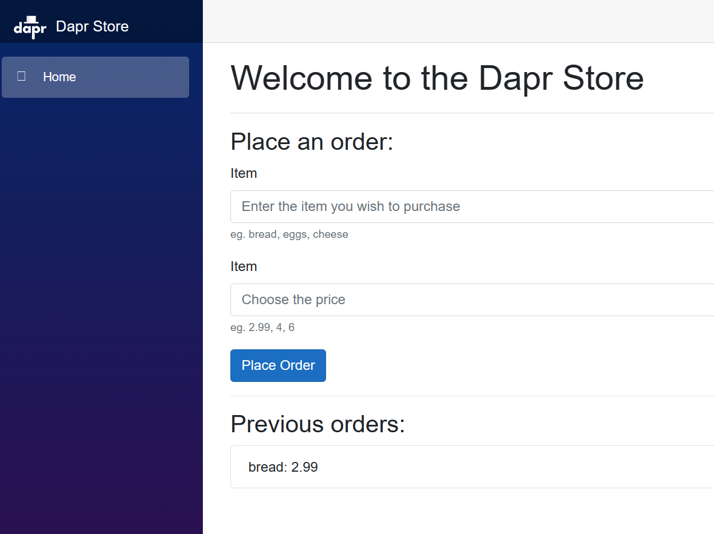

This tutorial will teach you the following about Dapr:

- How to use Radius to deploy a Dapr microservices sample application for an online shop
- How [Dapr and Radius]() seamlessly work together

For more details on the app and access to the source code, visit the `tutorials/dapr` directory in the [samples repo](https://github.com/radius-project/samples). _For access to the radius-project GitHub org, please complete and submit [this form](https://aka.ms/ProjectRadius/GitHubAccess)._

## Prerequisites

- [rad CLI]()
- [Radius Bicep VSCode extension]()
- [Setup a supported Kubernetes cluster](https://docs.radapp.io/guides/operations/kubernetes/overview/#supported-clusters)
- [Dapr installed on your Kubernetes cluster](https://docs.dapr.io/operations/hosting/kubernetes/kubernetes-deploy/)

## Step 1: Initialize a Radius Environment

1. Begin in a new directory for your application:

   ```bash
   mkdir rad-dapr
   cd rad-dapr
   ```
   
2. Initialize a new dev environment:
   
   *Select 'Yes' when prompted to create an application.*

   ```bash
   rad init
   ```

## Step 1: Define the application, `backend` container, and Dapr state store

Begin by creating a new file named `dapr.bicep` with a Radius Application that consists of a `backend` container and Dapr state store with Redis:



## Step 2: Deploy the `backend` application

1. Deploy the application's `backend` container and Dapr state store:

   ```sh
   rad run dapr.bicep
   ```

1. You can confirm all the resources were deployed by looking for `dapr`, `backend`, and `statestore` resources in the console logs:
   ```
   Deployment Complete

   Resources:
    dapr            Applications.Core/applications
    backend         Applications.Core/containers
    statestore      Applications.Dapr/stateStores
   ```

1. The `rad run` command automatically sets up port forwarding. Visit the the URL [http://localhost:3000/order](http://localhost:3000/order) in your browser. You should see the following message, which confirms the container is able to communicate with the state store:

   ```
   {"message":"no orders yet"}
   ```

1. Press CTRL+C to terminate the port-forward.

1. A [local-dev Recipe]() was run during application deployment to automatically create a lightweight Redis container plus a Dapr component configuration. Confirm that the Dapr Redis statestore was successfully created:

   ```sh
   dapr components -k -A
   ```

   You should see the following output:

   ```
   NAMESPACE      NAME         TYPE          VERSION  SCOPES  CREATED               AGE  
   default-dapr   statestore   state.redis   v1               2023-07-21 16:04.27   21m  
   ```

## Step 3: Define the `frontend` container

Add a `frontend` [container]() which will serve as the application's user interface.



## Step 4. Deploy and run the `frontend` application

1. Use Radius to deploy and run the application with a single command:

   ```sh
   rad run dapr.bicep
   ```

1. Your console should output a series of deployment logs, which you may check to confirm the `frontend` container was successfully deployed:

   ```
   Deployment Complete

   Resources:
      dapr            Applications.Core/applications
      backend         Applications.Core/containers
      frontend        Applications.Core/containers
      statestore      Applications.Dapr/stateStores
   ```

## Step 5. Test your application

In your browser, navigate to the endpoint (e.g. [http://localhost:8080](http://localhost:8080)) to view and interact with your application:

   

## Cleanup

1. Press `CTRL`+`C` to terminate the log console

1. Run the following command to cleanup your Radius Application, containers, and Dapr statestore. The Recipe resources (_Redis container and Dapr component_) are also automatically cleaned up.

   ```bash
   rad app delete
   ```

## Next steps

- Related links for Dapr:
  - [Dapr documentation](https://docs.dapr.io/)
  - [Dapr quickstarts](https://github.com/dapr/quickstarts/tree/v1.0.0/hello-world)
- If you'd like to try another tutorial with your existing environment, go back to the [Radius tutorials]() page.
