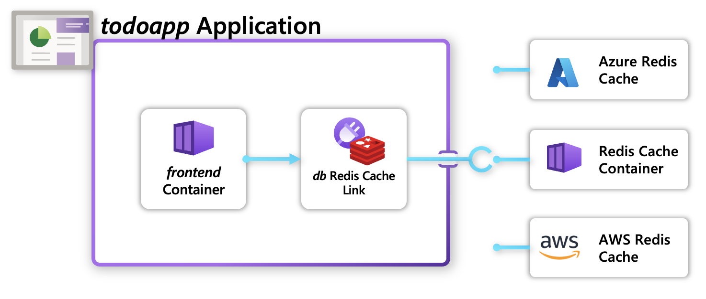
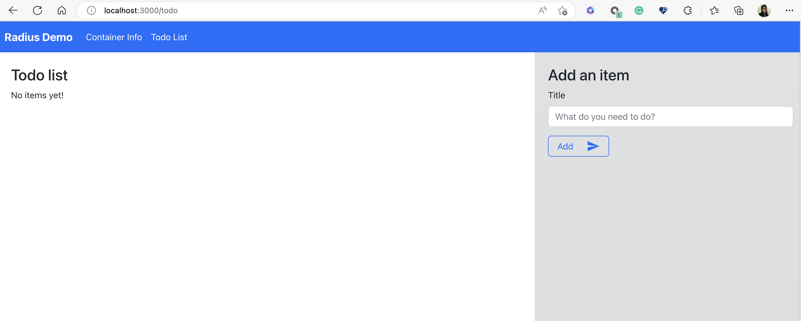

This how-to guide will teach you:

* How to use “dev” Recipes in your Radius Environment to quickly run with containerized infrastructure.
* How to deploy your own Recipes in your Radius Environment to leverage cloud resources.

## Prerequisites

- Install the [rad CLI]()
- Setup a supported [Kubernetes cluster]()

## Overview

[Recipes]() enable a separation of concerns between infrastructure teams and developers by automating infrastructure deployment. Developers define _what_ they need (_Redis, Mongo, etc._), and operators define _how_ it will be deployed (_Azure/AWS/Kubernetes infrastructure_).



## Application overview

This application is a simple to-do list which stores and visualizes to-do items. It consists of a frontend [container]() and a backend [Redis Cache]().




Developers don't need to specify what cloud resources they're using in their application. Instead, they choose the portable Redis API which can be provided by any cloud provider (or a Docker container). When deployed, a Recipe will select what infrastructure to deploy and run.


## Step 1: Initialize a Radius environment

1. Begin in a new directory for your application:

   ```bash
   mkdir recipes
   cd recipes
   ```
2. Initialize a new dev environment:

   ```bash
   rad init
   ```

   **Select 'Yes' when prompted to create an application.**

3. Use [`rad recipe list`]() to view the Recipes in your environment:

   ```bash
   rad recipe list 
   ```

   You should see a table of available Recipes (_with more to be added soon_):
   
   ```
   NAME          TYPE                              TEMPLATE
   default       Applications.Link/redisCaches     radius.azurecr.io/recipes/dev/rediscaches:v0.21
   ```

   
   Dev environments are preloaded with [`dev` Recipes](), a set of Recipes that allow you to quickly get up and running with lightweight containerized infrastructure. In This how-to guide, the dev Redis Recipe deploys a lightweight Redis container into your Kubernetes cluster.

   When a Recipe is named "default" it will be used by default when deploying resources when a Recipe is not specified.
   

## Step 2: Define your application

Update `app.bicep` with the following set of resources:

> app.bicep was created automatically when you ran `rad init`



Note that no Recipe name is specified with 'db', so it will be using the default Recipe in your environment.

## Step 3: Deploy your application

1. Run [`rad deploy`]() to deploy your application:

   ```bash
   rad deploy ./app.bicep
   ```

   You should see the following output:
   ```
   Building app.bicep...
   Deploying template './app.bicep' for application 'recipes' and environment 'default' from workspace 'default'...

   Deployment In Progress...

   Completed            db              Applications.Link/redisCaches
   Completed            webapp          Applications.Core/applications
   Completed            frontend        Applications.Core/containers

   Deployment Complete

   Resources:
      webapp          Applications.Core/applications
      frontend        Applications.Core/containers
      db              Applications.Link/redisCaches
   ```

   Your application is now deployed and running in your Kubernetes cluster.

2. List your Kubernetes Pods to see the infrastructure container deployed by the Recipe:

   ```bash
   kubectl get pods -n default-webapp
   ```

   You will see your 'frontend' container, along with the Redis cache that was automatically created by the default dev Recipe:

   ```
   NAME                                   READY   STATUS    RESTARTS   AGE
   frontend-6d447f5994-pnmzv              1/1     Running   0          13m
   redis-ymbjcqyjzwkpg-66fdbf8bb6-brb6q   2/2     Running   0          13m
   ```

3. Port-forward the container to your machine with `rad resource expose`:

   ```bash
   rad resource expose containers frontend --port 3000
   ```

4. Visit [`http://localhost:3000`](http://localhost:3000) in your browser.

   You can now see both the environment variables of your container as well as interact with the `Todo App` and add/remove items in it as wanted:

   
 
## Step 4: Use Azure recipes in your application

This step requires an Azure subscription to deploy cloud resources, which will incur costs. You will need to add the [Azure cloud provider]() to your environment in order to deploy Azure resources and leverage Azure Recipes.




{}

1. Delete your existing Redis cache, which we will redeploy with an Azure resource:

   ```bash
   rad resource delete rediscaches db
   ```

2. Register the Recipe to your Radius Environment:

   ```bash
   rad recipe register azure --environment default --template-kind bicep --template-path radius.azurecr.io/recipes/azure/rediscaches: --link-type Applications.Link/redisCaches 
   ```

3. Update your db resource to use the `azure` Recipe, instead of the default Recipe:

   

4. Redeploy your application to your environment:

   ```bash
   rad deploy ./app.bicep 
   ```

   This operation may take some time, as the 'azure' Recipe is deploying an Azure Cache for Redis resource into your Azure subscription. Once complete, you should see:

   ```
   Building ./app.bicep...
   Deploying template './app.bicep' for application 'recipes' and environment 'default' from workspace 'default'...

   Deployment In Progress... 

   Completed            webapp          Applications.Core/applications
   Completed            db              Applications.Link/redisCaches
   Completed            frontend        Applications.Core/containers

   Deployment Complete

   Resources:
      webapp          Applications.Core/applications
      frontend        Applications.Core/containers
      db              Applications.Link/redisCaches
   ```

{}


5. Use the az CLI to see your newly deployed Azure Cache for Redis:

   ```bash
   az redis list --subscription "My Subscription" --query "[].name" 
   ```

   You should see the name of your Redis cache, which is prefixed `cache`:

   ```
   [
     "cache-goqoxgqkw2ogw"
   ]
   ```

6. Port-forward the container to your machine with [`rad resource expose`]()

    ```bash
    rad resource expose containers frontend -a webapp --port 3000
    ```
7. Visit [localhost:3000](http://localhost:3000) in your browser again and interact with your application.

## Step 5: Cleanup your environment

You can use the rad CLI to [delete your environment]() and all the Radius resources running on your cluster:
   
```bash
rad env delete default --yes
```

## Next steps

- To learn how to create your own custom Recipe visit our [administrator guide]()
