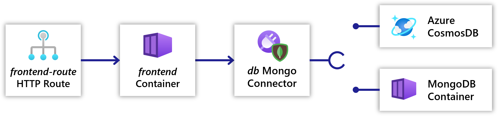

You will be deploying an application, `todoapp`, with the following resources:

1. [`frontend`](#frontend-container): A containerized to-do list frontend written in Node.JS
1. [`frontend-route`](#frontend-route-http-route): An [HTTP Route]() that exposes the frontend container to the internet
1. [`db`](#db-connector): A [MongoDB connector]() to save to-do items in. Can be backed by either:
   - A MongoDB container
   - An Azure CosmosDB w/ Mongo API

## Resources

### `frontend` container

The example website is a single-page-application (SPA) with a Node.JS backend running in a [container](). The SPA sends HTTP requests to the Node.JS backend to read and store todo items.

The website listens on port 3000 for HTTP requests.

The website uses the MongoDB protocol to read and store data in a database. The website reads the environment variable `CONNECTION_ITEMSTORE_CONNECTIONSTRING` to discover the database connection string. If the connection string is not set the website will store the todo items in memory and not persist them.

#### (optional) Download the source code

You can download the source code [here](https://get.radapp.dev/tutorials/webapp.zip) if you want to see how the frontend is built.

### `frontend-route` HTTP route

In order for users to connect to `frontend` over the internet, an [HTTP Route]() is used to define communication to the container, and the public gateway to configure.

### `db` connector

The database is provided by a [MongoDB connector](). You can choose between a MongoDB container or an Azure CosmosDB w/ Mongo API to back the connector.

## The Radius mindset

In this tutorial you will build out this app using the Radius application model. As you progress, keep in mind the following benefits that it provides:

- Both infrastructure (`db`) and services (`frontend`) are modeled as part of the application within the same template
- Relationships between resources are fully specified with protocols and other strongly-typed information
- Connectors provide abstraction and portability across local and cloud environments

 
